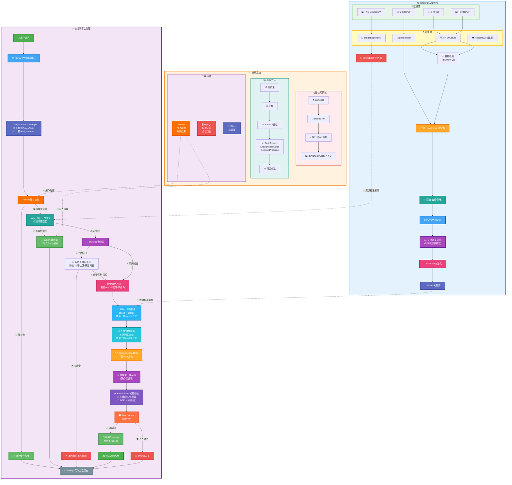

# 印刷企业内部知识库问答系统：项目设计文档

## 1. 项目概述

印刷企业内部知识库问答系统面向客服、印前、售后、生产支持和知识库维护人员，提供企业内部知识检索、标准问答、多轮追问和可控流式回答能力。

系统围绕印前规范、材料工艺、质量异常处理建议等高频业务场景建设，采用“标准问答优先 + BERT 查询分类 + RAG 文档检索 + 大模型生成”的混合问答架构。高频稳定问题由 MySQL 标准问答库直接返回；标准问答未命中时，先通过 BERT 分类判断问题是否需要查询企业知识库；专业问题进入 RAG 链路，基于内部文档检索结果生成回答。

系统定位为内部知识辅助工具，不直接执行报价、订单审核、生产排程、质量责任判定等业务决策。

## 2. 业务背景

印刷企业内部知识通常分散在 FAQ、印前规范、材料工艺手册、售后 SOP、质量异常案例和历史问答记录中。客服、印前、售后和生产支持人员遇到问题时，经常需要翻阅多个文档、询问经验员工或查询历史记录。

主要问题包括：

- 资料分散：PDF、Word、PPT、表格、扫描件等资料存放位置不统一。
- 标准不统一：不同员工对同一问题的解释可能存在差异。
- 新员工学习成本高：印前规范、材料工艺和异常处理依赖经验积累。
- 复杂问题检索困难：质量异常和工艺问题经常需要综合多个文档片段。
- 文档更新后使用效率低：新规范、新案例进入一线查询链路不及时。

行业背景上，国家新闻出版署《印刷业数字化三年行动计划（2025-2027年）》提出要完善贯穿印前、印刷、印后的数据交换和标准体系，提升印刷质量管理数字化水平，建设质检案例数据库，提供风险识别和质量帮扶服务。本系统聚焦企业内部知识服务，是印刷企业知识数字化的一部分。

## 3. 目标用户

| 用户角色 | 主要需求 | 系统价值 |
| --- | --- | --- |
| 客服人员 | 快速解释常见印前和工艺问题 | 降低反复询问成本，提升答复一致性 |
| 印前人员 | 查询文件格式、出血、CMYK、字体转曲、刀模线等要求 | 快速定位规范依据 |
| 售后人员 | 查询色差、覆膜起泡、胶装掉页、模切偏位等异常原因 | 获取排查方向和沟通参考 |
| 生产支持人员 | 查询材料、工艺、产品品类知识 | 辅助理解工艺注意事项 |
| 知识库维护人员 | 维护 FAQ、SOP、工艺手册和质量案例 | 确保知识更新后进入检索链路 |

## 4. 系统范围

### 4.1 包含范围

- 内部知识问答。
- 高频 FAQ 标准回答。
- BERT 查询分类，区分通用知识和专业咨询。
- RAG 文档检索增强。
- 知识域过滤。
- 多轮会话历史。
- WebSocket 流式输出，RAG 答案在服务端完成生成和一致性校验后再返回。
- 文档解析、OCR、清洗、脱敏、切块和向量化入库。
- 印前规范、材料工艺、质量异常处理建议三个主要场景。

### 4.2 不包含范围

- 不自动报价。
- 不做订单预审。
- 不做自动分单。
- 不控制生产设备。
- 不做生产排程。
- 不做质量责任判定。
- 不替代印前、工艺、质检、售后人员做最终结论。
- 不直接处理客户订单交易数据。

## 5. 核心业务场景

### 5.1 印前文件规范查询

典型问题：

- 为什么印刷文件要留出血？
- RGB 文件直接印刷会有什么问题？
- 图片分辨率过低会影响什么？
- 字体为什么要转曲？
- 刀模线文件需要注意什么？

处理方式：

- 高频、标准、答案稳定的问题沉淀到 MySQL 标准问答库。
- 系统通过 BM25 匹配标准问题，高置信命中后直接返回标准答案。
- 未高置信命中时进入 BERT 查询分类，由分类结果决定是否进入 RAG。

可靠性控制：

- 标准问答由业务人员维护。
- BM25 设置高置信阈值，避免相似但不准确的问题被直接返回。
- 未命中时不强行套用相似答案。

### 5.2 材料与工艺知识查询

典型问题：

- 铜版纸和哑粉纸有什么区别？
- 白卡纸适合做哪些印刷品？
- 覆膜和上光有什么区别？
- 烫金适合哪些产品？
- 纸盒为什么需要模切和压痕？

处理方式：

- 材料说明、工艺手册和产品知识文档进入 RAG 文档库。
- 专业问题进入 Milvus 检索，召回相关片段。
- 大模型基于检索上下文组织回答。

可靠性控制：

- 专业回答必须基于企业知识库检索结果，不直接凭模型常识给工艺结论。
- 检索范围、混合检索和精排策略见 [9.3 混合检索](#rag-hybrid-retrieval)。
- 答案引用和来源追溯见 [9.7 答案引用与来源追溯](#answer-citations)。

### 5.3 质量异常处理建议查询

典型问题：

- 印刷色差常见原因有哪些？
- 覆膜起泡可能是什么原因？
- 胶装掉页一般怎么排查？
- 模切偏位可能和哪些环节有关？
- 不干胶标签不粘可能是什么原因？

处理方式：

- 系统提供常见原因、排查方向和内部沟通参考。
- 涉及质量责任、赔付、客户争议时，只提供辅助信息，不给最终责任结论。

可靠性控制：

- 回答中区分“可能原因”“排查方向”“建议人工确认”。
- 检索不到明确依据时，返回无明确依据提示。
- 高风险业务问题转人工处理。

## 6. 总体架构

### 6.1 架构图



### 6.2 在线问答流程

```text
用户提问
  -> FastAPI / WebSocket 接收请求
  -> LangGraph StateGraph 初始化 GraphState
  -> 写入 query、session_id、allowed_sources、requested_sources
  -> 计算 final_sources = allowed_sources ∩ requested_sources，并写入 state
  -> load_history 节点加载最近会话历史，写入 state.history
  -> MySQL 标准问答库 + BM25 相似问题匹配
  -> 高置信命中：返回标准答案，并写入会话历史
  -> 未命中：进入 BERT 查询分类器
  -> 无关问题：进入印刷关键词复核
       -> 命中印前、材料、工艺、质量异常等词汇：按印刷相关处理，进入 RAG
       -> 未命中印刷词汇：返回超出范围提示
  -> 印刷相关：进入 RAG 检索增强流程
       -> StrategySelector 选择检索策略（直接检索/HyDE/回溯问题/子查询）
       -> BGE-M3 生成 dense/sparse 查询向量
       -> Milvus 混合检索候选子块（第一次 source 过滤）
       -> RRF 排名融合 dense/sparse 检索结果
       -> 回溯到父块，按父块去重
       -> 第二次 source 过滤，校验父块权限
       -> CrossEncoder reranker 精排候选父块
       -> 取 top-K 父块（如 top-3）
       -> 拼接父块完整内容、用户问题和最近会话历史
       -> 调用大模型生成草稿答案，并在服务端缓冲
       -> Faithfulness 轻量化一致性校验（高风险场景严格，一般场景轻量）
       -> 只删除无依据内容，不改写（方案A）
       -> risk_control 风险控制
       -> 组装答案引用 citations（引用父块中的子块）
       -> 通过：将最终答案通过 WebSocket 流式返回
       -> 不通过：拒答或转人工确认
  -> MySQL 保存最近会话历史
```

### 6.3 LangGraph 编排与状态设计

在线问答链路由 LangGraph `StateGraph` 编排。系统把一次问答请求抽象为 `GraphState`，各节点只从 state 读取需要的字段，并把本节点产物写回 state；节点之间不直接互相调用，分支跳转由条件边控制。

核心 `GraphState` 字段：

| 字段 | 含义 |
| --- | --- |
| `query` | 用户当前问题 |
| `session_id` | 会话标识，用于读取和保存最近多轮历史 |
| `history` | `load_history` 节点加载的最近会话历史 |
| `allowed_sources` / `requested_sources` / `final_sources` | 权限来源、请求来源和最终可检索知识域 |
| `faq_answer` / `faq_hit` | 标准问答命中结果 |
| `classification` / `keyword_review` | BERT 分类结果和印刷关键词复核结果 |
| `retrieval_strategy` | StrategySelector 选择的检索策略 |
| `retrieved_chunks` / `reranked_docs` | 混合召回和精排后的上下文 |
| `draft_answer` / `faithfulness_result` | 大模型草稿和答案-证据一致性校验结果 |
| `risk_result` / `citations` / `final_answer` | 风险控制、引用和最终答案 |

| 节点                           | 读取 state                 | 写入 state                                | 作用                                    |
| ---------------------------- | ------------------------- | ----------------------------------------- | ------------------------------------- |
| `init_state`                 | 请求体、Token              | `query`、`session_id`、`final_sources`     | 初始化问答状态，统一入口参数和知识域权限             |
| `load_history`               | `session_id`              | `history`                                 | 控制多轮上下文长度                             |
| `standard_qa_search`         | `query`                   | `faq_answer`、`faq_hit`                    | MySQL + BM25 高置信优先                    |
| `route_after_standard_qa`    | `faq_hit`                 | 下一节点                                   | 命中标准问答后提前结束                           |
| `query_classification`       | `query`                   | `classification`、`classification_score`   | BERT 前置路由，过滤明显无关问题                    |
| `printing_keyword_review`    | `query`、`classification` | `keyword_review`                           | 对无关分支做印刷领域关键词复核，降低专业问题被误拦截的风险        |
| `route_after_classification` | 分类和关键词复核结果          | 下一节点                                   | 印刷相关或关键词命中进入 RAG，最终未命中才返回超出范围提示       |
| `strategy_selector`          | `query`、`history`、业务上下文 | `retrieval_strategy`                       | 选择直接检索、HyDE、回溯问题或子查询检索策略             |
| `retrieve_docs`              | `query`、`final_sources`、`retrieval_strategy` | `retrieved_chunks`              | Milvus dense/sparse 混合召回，并按 source 过滤 |
| `rerank_docs`                | `retrieved_chunks`        | `reranked_docs`                            | CrossEncoder 精排父块，取 top-3            |
| `generate_answer`            | `query`、`history`、`reranked_docs` | `draft_answer`                        | 大模型基于父块内容组织表达，草稿不直接下发                 |
| `faithfulness_check`         | `draft_answer`、`reranked_docs` | `faithfulness_result`                  | 判断答案关键内容是否被父块支持，只删除无依据部分              |
| `risk_control`               | `faithfulness_result`、问题类型 | `risk_result`                         | 控制高风险业务结论和低依据回答                       |
| `build_citations`            | `risk_result`、`reranked_docs` | `citations`、文档级 `sources`           | 为保留的答案内容组装子块级引用，不展示越权来源               |
| `final_answer`               | `risk_result`、`citations` | `final_answer`、流式输出、会话落库          | 只返回通过校验或已降级处理的最终内容                    |

LangGraph 在系统中承担状态机和流程编排职责，用于显式表达 FAQ 命中、通用问题直答、专业问题 RAG、低置信分类兜底、生成后校验等分支规则。相比普通函数顺序调用，`GraphState` 让每个节点的输入输出可追踪，条件边让“命中即结束、无关拒答、校验失败转人工”等分支更清晰。

核心编排伪代码：

```python
class QAState(TypedDict):
    query: str
    session_id: str
    history: list[dict]
    allowed_sources: list[str]
    requested_sources: list[str]
    final_sources: list[str]
    faq_hit: bool
    faq_answer: str | None
    classification: str | None
    keyword_review: bool
    retrieval_strategy: str | None
    retrieved_chunks: list
    reranked_docs: list
    draft_answer: str | None
    faithfulness_passed: bool
    retry_count: int
    risk_level: str
    citations: list[dict]
    final_answer: str | None

graph = StateGraph(QAState)
graph.add_node("init_state", init_state)
graph.add_node("load_history", load_history)
graph.add_node("standard_qa_search", standard_qa_search)
graph.add_node("query_classification", query_classification)
graph.add_node("printing_keyword_review", printing_keyword_review)
graph.add_node("strategy_selector", strategy_selector)
graph.add_node("retrieve_docs", retrieve_docs)
graph.add_node("rerank_docs", rerank_docs)
graph.add_node("generate_answer", generate_answer)
graph.add_node("faithfulness_check", faithfulness_check)
graph.add_node("risk_control", risk_control)
graph.add_node("build_citations", build_citations)
graph.add_node("final_answer", final_answer)

graph.set_entry_point("init_state")
graph.add_edge("init_state", "load_history")
graph.add_edge("load_history", "standard_qa_search")
graph.add_conditional_edges("standard_qa_search", route_after_standard_qa)
graph.add_conditional_edges("query_classification", route_after_classification)
graph.add_edge("strategy_selector", "retrieve_docs")
graph.add_edge("retrieve_docs", "rerank_docs")
graph.add_edge("rerank_docs", "generate_answer")
graph.add_edge("generate_answer", "faithfulness_check")
graph.add_conditional_edges("faithfulness_check", route_after_faithfulness)
graph.add_edge("build_citations", "final_answer")
graph.add_edge("risk_control", "final_answer")
```

## 7. 技术栈

| 分层 | 技术栈 | 作用 |
| --- | --- | --- |
| 接口服务与数据契约 | Python、FastAPI、Pydantic、WebSocket | 提供问答接口、流式输出、接口入参和 RAG 边界数据校验 |
| 流程编排 | LangGraph `StateGraph` | 管理 FAQ、BERT 分类、RAG、生成、校验、落库等节点 |
| 标准问答 | MySQL、BM25、Redis | 高频稳定问题优先返回标准答案，Redis 提升高频查询速度 |
| 查询分类 | BERT、`bert-base-chinese`、`BertForSequenceClassification` | 在进入 RAG 前区分通用知识和专业咨询 |
| 文档解析 | `pdfplumber`、PaddleOCR PP-Structure、`pandas` / `openpyxl` | 离线解析 PDF、扫描件、图文混排资料和 FAQ 表格，PP-Structure 返回置信度用于质量检测 |
| 数据治理 | 正则清洗、去重、脱敏、版本记录、元数据补充 | 控制入库质量，降低错误知识进入检索链路 |
| 切块策略 | 父子块切分、ModelScope `nlp_bert_document-segmentation_chinese-base`、长度兜底、overlap | 子块用于精确命中，父块用于完整上下文 |
| 向量化 | BGE-M3 dense/sparse | 同时支持语义召回和关键词召回 |
| 向量库 | Milvus Hybrid Search、RRF 排名融合 | 存储文档向量并融合 dense/sparse 检索结果 |
| 精排 | BGE-Reranker / `CrossEncoder` | 对候选文档做 query-doc 相关性重排 |
| 生成模型 | DashScope / Qwen-Plus，OpenAI-compatible API | 基于检索上下文组织答案 |
| 答案引用 | `citations`、source chunk metadata、trace_id | 返回答案时携带来源页码、章节和命中片段，支持员工追溯依据 |
| 检索调试 | Retrieval Debug API、dense/sparse/rerank score、prompt context preview | 内部查看召回链路和最终进入 prompt 的上下文 |
| 会话与审计 | MySQL 会话历史、日志 | 支持最近多轮追问和问题排查 |
| 评估与可靠性 | RAGAS、检索指标、人工抽检 | 评估体系见 [第 12 章 评估指标](#evaluation-metrics) |

## 8. 知识库建设

### 8.1 知识来源

系统优先接入核心内部资料，资料类型包括：

| 知识来源 | 示例内容 | 进入方式 |
| --- | --- | --- |
| 高频 FAQ | 出血、CMYK、字体转曲、分辨率 | MySQL 标准问答库 |
| 印前规范 | 文件格式、出血、安全边距、刀模线 | RAG 文档库 |
| 材料工艺手册 | 纸张、覆膜、上光、烫金、UV、模切 | RAG 文档库 |
| 产品品类说明 | 纸盒、画册、标签、说明书、手提袋 | RAG 文档库 |
| 售后 SOP | 投诉处理流程、沟通话术、异常记录 | RAG 文档库 |
| 质量异常案例 | 色差、起泡、掉页、偏位、不粘 | RAG 文档库 |

### 8.2 入库流程

```text
资料收集
  -> 按知识域分类
  -> 判断文件类型和文档质量
  -> FAQ 表格：pandas / openpyxl 解析，写入 MySQL 标准问答库
  -> 文本型 PDF：pdfplumber 抽取文本和简单表格
  -> 复杂 PDF / 扫描件：PP-Structure 解析（返回置信度）
  -> 质量检测：基于置信度评分，A/B/C/D 分级处理
  -> 统一 Markdown / JSON
  -> 文本清洗
  -> 去重
  -> 敏感信息脱敏
  -> 补充 source、文件名、版本、部门、更新时间等元数据
  -> 父块结构切分
  -> 子块语义切分
  -> 长度兜底和 overlap 处理
  -> BGE-M3 向量化
  -> 写入 Milvus
```

### 8.3 文档解析与 OCR 分层策略

系统采用”轻量优先 + 复杂兜底”的解析策略，避免所有文档都进入重 OCR 链路。

#### 8.3.1 工具选择与适用场景

| 文档类型 | 工具 | 处理方式 | 可靠性控制 |
| --- | --- | --- | --- |
| FAQ Excel / CSV | `pandas` / `openpyxl` | 拆分为 question-answer，写入 MySQL | 标准答案由业务人员维护 |
| 可复制文字的普通 PDF | `pdfplumber` | 抽取文本和简单表格，进入 Markdown 清洗 | 适合印前规范和普通 SOP |
| 复杂 PDF / 扫描件 | PaddleOCR PP-Structure | 版面分析 + OCR，返回置信度用于质量评分 | 主解析引擎，返回每个元素的 confidence |
| Word / PPT | PP-Structure / Docling（可选扩展） | 转结构化文本后进入统一清洗链路 | 非首期主链路，保留文档类型和来源版本 |

OCR 结果不直接无条件入库。PP-Structure 返回的置信度是质量检测的核心指标，系统基于 6 个维度（平均置信度、最低置信度、低置信度占比、文本密度、结构完整性、置信度稳定性）综合评分，分为 A/B/C/D 四级处理。低置信内容标记为待复核；涉及尺寸、材料、工艺参数、质量标准的内容需要抽样人工确认，避免 OCR 错误影响 RAG 回答。

#### 8.3.2 核心工具对比与选型依据

**pdfplumber vs PP-Structure vs PaddleOCR**

| 维度 | pdfplumber | PP-Structure | PaddleOCR |
| --- | --- | --- | --- |
| **核心能力** | 文本提取 | 版面理解 + OCR + 置信度 | 文字识别（OCR） |
| **置信度返回** | 无 | ✅ 每个元素都有 confidence | ✅ 有，但无版面理解 |
| **模型依赖** | 无需模型 | 需要版面分析 + OCR 模型 | 需要 OCR 模型 |
| **本地部署** | 不需要 | 需要（模型 200-500MB） | 需要（模型 200-500MB） |
| **GPU 需求** | 不需要 | 推荐 | 推荐 |
| **内存占用** | 低（< 500MB） | 中（1-2GB） | 中（1-2GB） |
| **处理速度** | 快（< 0.1 秒/页） | 中（1-2 秒/页） | 中（1-2 秒/页） |
| **表格处理** | 简单表格可提取 | ✅ 保留完整结构 + HTML | 只识别文字，结构丢失 |
| **图片处理** | 无法处理 | ✅ 自动提取并 OCR | 专门处理图片 |
| **版面理解** | 无 | ✅ 强（理解标题、段落、表格关系） | 无（只识别文字位置） |
| **质量评估** | 无法评估 | ✅ 基于置信度精确评分 | ⚠️ 有置信度但无结构 |
| **适用场景** | 纯文本 PDF | **复杂 PDF、扫描件（主方案）** | 简单扫描件（备用） |

**PP-Structure 的工作原理**

PP-Structure 是 PaddleOCR 推出的文档结构化分析工具，核心优势是**同时提供版面分析和置信度评分**：

```
PDF/图片 输入
  ↓
版面分析（Layout Analysis）
  ├─ 检测区域类型：text、title、table、figure
  ├─ 定位边界框（bbox）
  └─ 确定阅读顺序
  ↓
内容识别
  ├─ 文本区域 → OCR 识别 + confidence
  ├─ 表格区域 → 表格识别 + 结构化 HTML + confidence
  └─ 图片区域 → 保存位置信息
  ↓
输出结构化 JSON
  └─ 每个元素包含：type、bbox、text、confidence
```

**关键特性**：

1. **置信度评分**：每个识别元素都有 0-1 的 confidence 分数
2. **版面理解**：区分标题、正文、表格、图片，保持阅读顺序
3. **表格识别**：输出结构化 HTML，保留行列关系
4. **中文优化**：专门针对中文文档训练
5. **轻量高效**：比 MinerU 更快（1-2 秒/页 vs 5-10 秒/页）

**PP-Structure 与纯 PaddleOCR 的区别**：

- **纯 PaddleOCR**：只做 OCR，不理解版面结构
- **PP-Structure**：PaddleOCR + 版面分析，知道哪些文字属于表格、哪些是标题

**为什么用 PP-Structure 而不是纯 PaddleOCR**

如果只用纯 PaddleOCR 处理复杂 PDF，会遇到以下问题：

1. **表格结构丢失**：OCR 只能识别文字，不知道哪些文字属于同一个表格单元格
   ```
   原始表格：
   | 材料 | 克重 | 适用场景 |
   | 铜版纸 | 128g | 画册 |
   
   PaddleOCR 输出：
   “材料 克重 适用场景 铜版纸 128g 画册”
   （结构完全丢失）
   ```

2. **阅读顺序混乱**：多栏排版时，OCR 按位置从上到下识别，可能把左栏和右栏的内容混在一起
   ```
   原始文档（两栏）：
   左栏：覆膜工艺介绍...    右栏：烫金工艺介绍...
   
   PaddleOCR 输出：
   “覆膜工艺介绍... 烫金工艺介绍...”
   （左右栏内容交错混乱）
   ```

3. **图文关系不清**：不知道哪段文字是图注，哪段是正文

**选型决策树**

```
判断文档类型
  ↓
是否为纯文本 PDF（可复制文字）？
  ├─ 是 → pdfplumber（最快，资源占用最少）
  └─ 否 → 需要 OCR
           ↓
         是否需要质量把控？
           ├─ 是（本项目）→ PP-Structure（返回置信度 + 版面理解）
           └─ 否 → 纯 PaddleOCR（只要识别结果）
```

#### 8.3.3 资源需求与部署成本

| 方案 | CPU | 内存 | GPU | 磁盘空间 | 单页处理时间 |
| --- | --- | --- | --- | --- | --- |
| **pdfplumber** | 低 | < 500MB | 不需要 | < 100MB | < 0.1 秒 |
| **PP-Structure** | 中 | 1-2GB | 推荐 | 200-500MB | 1-2 秒 |
| **PaddleOCR** | 中 | 1-2GB | 推荐 | 200-500MB | 1-2 秒 |

**部署说明**：

- **pdfplumber**：纯 Python 库，无需额外部署
- **PP-Structure**：首次运行时自动下载模型到 `~/.paddleocr/`，包含版面分析、文本检测、文本识别模型
- **PaddleOCR**：与 PP-Structure 共享模型文件

**性能优化建议**：

- 离线入库阶段可以使用 GPU 加速，提升 PP-Structure 处理速度
- 批量处理时可以并行处理多个文档，充分利用多核 CPU
- 对于大文件（> 100 页），可以分页处理，避免内存溢出

#### 8.3.4 实际应用示例

**示例 1：工艺手册（复杂 PDF）**

文档特点：
- 大量工艺参数表格（需要保留行列结构）
- 工艺流程图（需要提取并 OCR 图中文字）
- 多栏排版（需要正确的阅读顺序）

选择方案：PP-Structure

输出效果：
```markdown
## 覆膜工艺参数

| 参数 | 亮膜 | 哑膜 |
|------|------|------|
| 温度 | 90-100℃ | 85-95℃ |
| 压力 | 0.6-0.8MPa | 0.5-0.7MPa |
| 速度 | 20-30m/min | 15-25m/min |

（置信度：0.92，质量等级：A）


流程说明：上胶 → 烘干 → 复合 → 冷却
（置信度：0.88）
```

**示例 2：扫描的质量案例（扫描件）**

文档特点：
- 整页都是图片
- 没有可复制的文字
- 版面相对简单

选择方案：PP-Structure

输出效果：
```
案例编号：QC-2025-001（置信度：0.95）
问题描述：覆膜起泡（置信度：0.91）
原因分析：胶水干燥不足（置信度：0.89）
解决方案：延长烘干时间至 5 分钟（置信度：0.87）

综合质量评分：0.90（A 级，直接入库）
```

**示例 3：印前规范（简单 PDF）**

文档特点：
- 纯文本，可复制
- 没有复杂表格和图片
- 格式规范

选择方案：pdfplumber

输出效果：
```
印前文件规范

1. 出血设置
   印刷文件需要留出血 3mm，避免裁切时出现白边。

2. 颜色模式
   印刷文件必须使用 CMYK 颜色模式，RGB 文件会导致色差。
```

#### 8.3.5 文档质量检测与入库把控

文档解析完成后不直接入库，需要经过质量检测环节，确保低质量文档不进入知识库影响 RAG 回答准确性。

**核心思路**：

系统采用 **PaddleOCR PP-Structure** 作为主解析引擎，因为它会为每个识别元素返回 **confidence 置信度分数**（0-1），这是质量评估的核心依据。相比 MinerU（不返回置信度），PP-Structure 让质量把控变得可量化、可追溯。

**质量评分体系（6 个维度）**：

| 维度 | 权重 | 检测内容 | 阈值 |
| --- | --- | --- | --- |
| 平均置信度 | 30% | PP-Structure 返回的所有文本块平均置信度 | 优秀 >0.9，良好 >0.8，及格 >0.7 |
| 最低置信度 | 20% | 检测是否存在极低质量元素 | 合格 >0.7，可接受 >0.5 |
| 低置信度占比 | 15% | 统计置信度 <0.7 的元素比例 | 优秀 <10%，可接受 <30% |
| 文本密度 | 15% | 每页平均字符数 | 合格 >200 字符/页 |
| 结构完整性 | 10% | 是否识别出标题、表格、段落等元素 | 至少识别到一种结构元素 |
| 置信度稳定性 | 10% | 置信度标准差（波动程度） | 稳定 <0.1，可接受 <0.2 |

**质量等级划分**：

```
综合评分计算后分为 4 个等级：
- A 级（≥0.9）：优秀，直接入库
- B 级（0.7-0.9）：良好，入库但标记需抽查
- C 级（0.5-0.7）：及格，触发降级重试
- D 级（<0.5）：不合格，拒绝入库并推送人工队列
```

**处理流程**：

```text
1. PP-Structure 解析文档
   → 返回每个元素的 text + confidence + bbox + type
   
2. 提取质量指标
   → 统计所有置信度、计算平均值/最低值/标准差
   → 统计文本密度、结构元素数量
   
3. 综合评分
   → 按权重计算总分（0-1）
   → 判定等级（A/B/C/D）
   
4. 分级处理
   → A 级：直接入库
   → B 级：入库 + 标记待复核（定期人工抽查）
   → C 级：降级处理（见下方）
   → D 级：拒绝 + 人工队列
```

**降级处理策略（C 级触发）**：

```text
策略 1：逐页分析
  → 定位具体是哪几页质量低（而非整个文档）
  → 只对问题页重新解析（提高 DPI、增强预处理）
  
策略 2：兜底引擎
  → PP-Structure 失败后降级到 Tesseract OCR
  → 阈值适当降低（从 0.7 降到 0.5-0.6）
  
策略 3：所有引擎都失败
  → 推送到人工审核队列
  → 提供原始文件、解析结果、问题页清单供人工处理
```

**人工审核机制**：

管理后台提供待审核列表，展示：
- 文档名称、上传时间、质量评分
- 失败原因（如"第 3、8 页置信度过低"）
- 尝试过的解析引擎
- 预览文本（前 500 字）

审核员可选择：
- 手动上传修正后的文本
- 调整 OCR 参数重新解析
- 标记为"无法处理"归档

**监控与告警**：

系统实时监控以下指标：
- OCR 成功率（按时间段统计）
- 平均质量分趋势
- 人工队列堆积数量

触发告警条件：
- 连续 5 个文档评分 <0.5 → 通知管理员
- 人工队列 >20 个文档 → 升级告警
- 单日平均质量分下降 >20% → 检查文档来源

**与 MinerU 的对比**：

| 方面 | PP-Structure 方案 | MinerU 方案 |
| --- | --- | --- |
| 置信度 | ✅ 每个元素都有 confidence | ❌ 不返回置信度 |
| 质量量化 | ✅ 可精确评分（0-1） | ⚠️ 需自行构建评估指标 |
| 问题定位 | ✅ 可定位到具体页/元素 | ⚠️ 只能整体判断 |
| 中文优化 | ✅ 专门优化中文场景 | ⚠️ 通用模型 |
| 表格处理 | ✅ 返回结构化 HTML + 置信度 | ✅ 保留结构但无置信度 |

**选型建议**：

- **需要质量把控**的场景 → PP-Structure（本项目选择）
- **复杂学术论文**、英文为主 → MinerU
- **混合方案**：先用 PP-Structure 评估质量，A/B 级直接用；C/D 级尝试 MinerU 看能否提升

**面试回答要点**：

> "我们对文档入库有一套完整的质量检测机制。选择 **PP-Structure** 作为主解析引擎，因为它会返回每个元素的**置信度分数**，这让质量评估变得可量化。
> 
> 我们设计了 **6 个维度**的评分体系：平均置信度、最低置信度、低置信度占比、文本密度、结构完整性、置信度稳定性，综合计算后分为 A/B/C/D 四个等级。
> 
> **A 级直接入库，B 级入库但标记待抽查，C 级触发降级处理**（逐页分析、更换引擎、提高参数），**D 级拒绝入库并推送人工队列**。
> 
> 关键优势是能**精确定位问题页**，比如检测到第 3、8 页置信度低，就只针对这两页重新处理，而不是整个文档重来，大大提高了效率。
> 
> 同时我们有**监控告警机制**，实时跟踪 OCR 成功率、平均质量分、人工队列堆积情况，确保问题及时发现。"

### 8.4 父子块与语义切分策略

系统采用“父块结构保真 + 子块语义切分 + 长度兜底 + overlap 边界保留”的切分策略。

这里的语义切分不是用 embedding 相似度简单聚类，也不是完全依赖固定长度窗口，而是在父块内部使用中文文档分割模型识别段落边界、主题切换点和知识点边界，再用长度规则做工程兜底。模型只用于离线入库阶段，不放在在线问答主链路中，避免增加用户提问时的响应延迟。

模型选择：

| 方案                                            | 特点                         | 使用方式                  |
| --------------------------------------------- | -------------------------- | --------------------- |
| 固定长度 / 标点规则切分                                 | 实现简单、稳定，但容易切断完整知识点         | 作为模型异常、短文本、表格文本的兜底    |
| `nlp_bert_document-segmentation_chinese-base` | 面向中文长文本的文档分割模型，适合识别段落和语义边界 | 作为子块语义切分的主方案          |
| 大模型切分                                         | 语义理解更强，但成本高、速度慢、结果一致性较难控制  | 不作为默认入库链路，只用于疑难文档抽样辅助 |

| 层级 | 切分方式 | 目标 |
| --- | --- | --- |
| 父块 | 按标题、章节、页码、段落结构切分 | 保留完整上下文，供 reranker 和大模型生成使用 |
| 子块 | 使用 `nlp_bert_document-segmentation_chinese-base` 在父块内识别中文语义边界 | 让每个子块尽量表达一个完整小知识点，提高向量检索精度 |
| 兜底 | 使用 `child_chunk_size`、`chunk_overlap`、句子和标点规则控制长度 | 防止块过长、过短或关键信息落在边界处 |

切分流程：

```text
Markdown / JSON 文本
  -> 按标题、章节、页码、段落生成父块
  -> 在父块内部调用中文文档分割模型识别语义边界
  -> 生成子块
  -> 子块过长：继续按句子、标点或长度窗口切分
  -> 子块过短：与相邻子块合并
  -> 相邻子块保留 overlap
  -> 子块携带 parent_id、parent_content、source、page、section 等元数据
```

推荐参数：

| 参数                  | 建议值      | 说明           |
| ------------------- | -------- | ------------ |
| `parent_chunk_size` | 约 1200 字 | 保留较完整上下文     |
| `child_chunk_size`  | 约 300 字  | 适合作为向量检索最小单位 |
| `chunk_overlap`     | 约 50 字   | 减少边界信息丢失     |

切分质量校验：

- 统计子块长度分布，过短块和过长块需要进入规则修正。
- 抽样检查子块是否表达完整知识点，避免把“条件、参数、结论”拆散。
- 对表格、尺寸标准、材料规格、工艺参数等内容做整体保留，必要时按行或按表格单元组块。
- OCR 噪声较多、标点缺失或换行异常的文本，先做清洗再进入模型切分。
- 保留 `chunk_method`，区分 `structure`、`bert_semantic` 和 `rule_fallback`，便于后续排查召回问题。
- 通过 Hit@K、MRR、人工抽检语义完整率评估切分策略是否提升检索效果。

注意事项：

- 文档分割模型只负责识别语义边界，不能完全替代规则控制。
- 父块不能切得太碎，否则生成阶段缺少上下文。
- 子块不能过长，否则 embedding 语义容易发散；也不能过短，否则缺少必要背景。
- 子块内容应尽量携带标题路径，例如“文档名 > 章节标题 > 小节标题 + 正文”。
- 表格、工艺参数、尺寸标准、材料规格需要尽量整体保留，不能硬切成多个无上下文片段。
- 模型输出异常、文本过短、表格结构不适合模型切分时，回退到“标题 -> 段落 -> 句子 -> 长度窗口”的规则切分。
- 最终入库的是子块向量，但每个子块必须携带父块内容，检索命中子块后回到父块作为生成上下文。

### 8.5 元数据设计

| 字段 | 用途 |
| --- | --- |
| `source` | 知识域过滤和模块级隔离，例如 `prepress`、`material_process`、`quality_issue` |
| `file_name` | 原始文档名称，作为文档唯一标识 |
| `doc_type` | PDF、Word、PPT、image、faq |
| `parse_method` | `pdfplumber`、`mineru`、`paddleocr`、`manual_faq` |
| `page` | 页码或图片序号，便于人工复核 |
| `section` | 文档章节 |
| `chunk_id` | 子块 ID |
| `parent_id` | 父块 ID |
| `parent_content` | 父块完整内容，用于检索命中后还原上下文 |
| `chunk_type` | `parent` / `child`，标识块类型 |
| `chunk_method` | `structure`、`bert_semantic`、`rule_fallback` 等切分方式 |
| `chunk_index` | 子块在父块中的顺序，用于上下文还原和相邻块补全 |
| `chunk_length` | 子块长度，用于入库质量检查 |
| `ocr_confidence` | OCR 置信度，低置信内容进入待复核队列 |
| `department` | 来源部门，例如印前、工艺、质检、售后 |
| `version` | 规范版本 |
| `update_time` | 文档更新时间 |

### 8.6 知识库更新与删除

#### 8.6.1 文档管理

系统通过 MySQL 维护文档注册表，使用**文件名**作为唯一标识：

```sql
CREATE TABLE documents (
    id INT AUTO_INCREMENT PRIMARY KEY,
    file_name VARCHAR(255) UNIQUE,        -- 文件名唯一约束
    file_path VARCHAR(512),               -- 完整路径
    chunk_count INT,                      -- chunk数量
    created_at DATETIME,
    updated_at DATETIME,
    INDEX idx_file_name (file_name)
);
```

Milvus 中的每个 chunk 通过 `file_name` 字段关联所属文档。

**文件命名规范**：
- 文件名必须唯一且有描述性
- 建议格式：`{文档类型}_{版本/专题}.pdf`
- 示例：`覆膜工艺手册.pdf`、`印前规范_2026版.pdf`、`质量案例集_覆膜专题.pdf`

#### 8.6.2 文档更新

**更新流程**：

```
上传新版本文档
  ↓
提取文件名（如"覆膜工艺手册.pdf"）
  ↓
删除 Milvus 中所有 file_name = "覆膜工艺手册.pdf" 的 chunk
  ↓
解析新文档 → 切块 → 向量化
  ↓
插入新 chunk 到 Milvus（带上 file_name）
  ↓
更新 MySQL 中的文档记录
  ↓
清除 Redis 相关缓存
```

**代码示例**：

```python
def update_document(file_path):
    file_name = os.path.basename(file_path)
    
    # 1. 删除旧版本
    milvus.delete(
        collection_name="knowledge_base",
        expr=f'file_name == "{file_name}"'
    )
    
    # 2. 处理新文档
    chunks = process_document(file_path)
    for chunk in chunks:
        chunk['file_name'] = file_name
    
    # 3. 插入新chunk
    milvus.insert(collection_name="knowledge_base", data=chunks)
    
    # 4. 更新MySQL
    mysql.execute("""
        UPDATE documents 
        SET file_path = %s, chunk_count = %s, updated_at = NOW()
        WHERE file_name = %s
    """, (file_path, len(chunks), file_name))
```

**特点**：
- 同名文件自动覆盖旧版本
- 立即生效，无需等待
- 更新耗时取决于文档大小（通常 10-30 秒）

#### 8.6.3 文档删除

**删除流程**：

```
指定文件名
  ↓
查询 MySQL 确认文档是否存在
  ↓
文档不存在 → 返回提示
  ↓
文档存在 → 删除 Milvus 中所有该文件名的 chunk
  ↓
删除 MySQL 中的文档记录
  ↓
清除 Redis 相关缓存
  ↓
记录删除日志（可选）
```

**代码示例**：

```python
def delete_document(file_name, operator=None):
    """
    删除文档
    
    Args:
        file_name: 文件名
        operator: 操作人（可选，用于审计）
    
    Returns:
        bool: 是否删除成功
    """
    # 1. 查询文档是否存在
    doc = mysql.query(
        "SELECT * FROM documents WHERE file_name = %s",
        (file_name,)
    )
    
    if not doc:
        logger.warning(f"删除失败：文档不存在 - {file_name}")
        return False
    
    chunk_count = doc['chunk_count']
    
    # 2. 删除Milvus中的chunk
    try:
        milvus.delete(
            collection_name="knowledge_base",
            expr=f'file_name == "{file_name}"'
        )
        logger.info(f"已从Milvus删除 {chunk_count} 个chunk")
    except Exception as e:
        logger.error(f"Milvus删除失败: {e}")
        return False
    
    # 3. 删除MySQL记录
    try:
        mysql.execute(
            "DELETE FROM documents WHERE file_name = %s",
            (file_name,)
        )
    except Exception as e:
        logger.error(f"MySQL删除失败: {e}")
        return False
    
    # 4. 清除Redis缓存
    redis.delete(f"faq:{file_name}:*")
    
    # 5. 记录删除日志（可选）
    if operator:
        mysql.execute("""
            INSERT INTO operation_logs 
            (operation, file_name, operator, timestamp)
            VALUES ('delete', %s, %s, NOW())
        """, (file_name, operator))
    
    logger.info(f"✅ 文档删除成功: {file_name}")
    return True
```

**特点**：
- 先查询确认文档存在，避免无效操作
- 异常处理，确保删除过程可控
- 记录删除日志，便于审计追溯
- 同步清除 Redis 缓存

#### 8.6.4 批量更新策略

| 场景 | 策略 | 说明 |
| --- | --- | --- |
| 单个或少量文档更新（< 10 个） | 增量更新 | 逐个删除旧版本，插入新版本 |
| 大批量更新（> 10 个） | 全量重建 | 创建新 collection，测试后切换 |
| 切分策略调整 | 全量重建 | chunk_size 变化导致所有 chunk 需重新生成 |
| 向量模型更换 | 全量重建 | 所有 chunk 需重新向量化 |

**全量重建流程**：

```
创建新 collection（如 knowledge_base_v2）
  ↓
批量处理所有文档写入新 collection
  ↓
测试新 collection 的检索效果
  ↓
切换应用指向新 collection
  ↓
删除旧 collection
```

**优点**：可测试、可回滚、不影响线上服务

#### 8.6.5 更新生效机制

- **Milvus**：插入/删除后立即生效，无需等待索引重建
- **Redis 缓存**：更新文档时需清除相关 FAQ 缓存
- **MySQL 标准问答库**：需手动同步更新

#### 8.6.6 版本管理

系统采用**覆盖更新**策略：
- 同名文件自动覆盖旧版本
- 只保留最新版本，不保留历史版本
- MySQL 记录每次更新时间，便于追溯

**如需保留历史版本**：
- 方案 1：文件名中加版本号（如 `覆膜工艺手册_v1.0.pdf`、`覆膜工艺手册_v2.0.pdf`）
- 方案 2：在元数据中增加 `is_active` 字段，检索时只返回 `is_active=true` 的文档

## 9. 查询路由与 RAG 设计

### 9.1 标准问答优先

高频且答案稳定的问题优先走 MySQL 标准问答库。BM25 只负责相似问题匹配，不负责生成答案。命中分数达到高置信阈值后，系统直接返回标准答案并写入会话历史。

适用问题包括：

- 什么是出血？
- CMYK 和 RGB 有什么区别？
- 为什么字体要转曲？
- 图片分辨率最低要求是多少？

标准问答链路用于控制高频问题的一致性、延迟和成本。

### 9.2 BERT 查询分类

标准问答未命中后，系统进入 BERT 查询分类节点，判断问题是否与印刷业务相关。

分类结果处理规则：

- `印刷相关`：进入 RAG 检索增强流程。
- `无关问题`：先进入印刷领域关键词复核；如果命中印前、材料、工艺、质量异常等词汇，仍按印刷相关问题进入 RAG；未命中时才返回"您的问题超出印刷知识库范围，请咨询相关业务问题"。
- 低置信或边界模糊问题：优先进入 RAG，避免印刷相关问题被误判为无关。

印刷关键词复核用于处理 BERT 高置信但仍误判的情况。词表覆盖印前规范、文件格式、出血、安全边距、CMYK、纸张克重、覆膜、上光、烫金、UV、模切、刀模、色差、起泡、掉页、偏位、不粘等高频业务词。它只作用在 `无关问题` 分支上，作为拒答前的最后一道轻量保护。

示例：

| 用户问题 | 分类 | 处理方式 |
| --- | --- | --- |
| 写一个 Python 函数判断素数 | 无关问题 | 返回超出范围提示 |
| 覆膜起泡怎么排查 | 印刷相关 | 进入 RAG |
| RGB 文件为什么不建议直接印刷 | 印刷相关 | 进入 RAG |
| 为什么覆膜后会起泡 | 无关问题但命中印刷关键词 | 关键词复核后进入 RAG |
| 今天天气怎么样 | 无关问题 | 返回超出范围提示 |

<a id="rag-hybrid-retrieval"></a>

### 9.3 混合检索与父子块处理

RAG 检索采用 dense/sparse 混合召回、知识域过滤、父子块上下文补全和 reranker 精排的组合策略。

#### 9.3.1 检索策略选择

`strategy_selector` 节点根据问题特征选择不同的检索策略：

| 检索策略 | 适用场景 | 处理方式 |
| --- | --- | --- |
| **直接检索** | 问题明确、关键词清晰 | 直接用原问题生成向量检索 |
| **HyDE 假设答案检索** | 问题较短、缺少上下文 | 先让大模型生成假设答案，用假设答案的向量检索 |
| **回溯问题检索** | 多轮对话、指代不清 | 结合会话历史改写为完整独立问题后检索 |
| **子查询检索** | 复合问题、多个关注点 | 拆分为多个子问题，分别检索后合并结果 |

选择依据：
- 问题长度 < 10 字 → 考虑 HyDE
- 包含"这个""那个"等指代词 → 回溯问题检索
- 包含"和""以及"等连接词且涉及多个主题 → 子查询检索
- 其他情况 → 直接检索

#### 9.3.2 混合检索步骤

1. **生成查询向量**：根据选定策略生成 BGE-M3 dense 向量和 sparse 向量。
2. **知识域过滤（第一次）**：使用 `final_sources` 限定知识域，在 Milvus 中执行 Hybrid Search，metadata filter: `source in final_sources`。
3. **融合召回结果**：使用 RRF（Reciprocal Rank Fusion）按 dense/sparse 两路排名融合结果，得到候选子块列表（如 top-20）。RRF 不直接比较两路原始分数，而是优先保留两路都靠前的候选，避免分数尺度不一致影响排序。
4. **回溯到父块**：根据子块的 `parent_id` 回溯到父块，按父块去重（多个子块可能属于同一父块）。
5. **知识域过滤（第二次）**：再次校验父块的 `source` 字段是否在 `final_sources` 中，防止 Milvus metadata filter 失效。
6. **精排父块**：使用 CrossEncoder reranker 对候选父块重新排序，取 top-K（如 top-3）。
7. **传入生成节点**：将排序后的 top-K 父块完整内容拼接，传入大模型生成答案。

#### 9.3.3 父子块使用说明

**检索阶段**：
- 子块向量存储在 Milvus 中，用于精确匹配
- 每个子块携带 `parent_id`、`parent_content`、`chunk_index` 等元数据

**召回阶段**：
- 检索返回命中的子块列表（如 20 个子块）
- 根据 `parent_id` 回溯，可能对应 8-12 个父块
- 按父块去重，保留每个父块的最高分子块信息

**精排阶段**：
- 对父块列表使用 CrossEncoder 重新排序
- 取 top-3 父块传入大模型

**生成阶段**：
- 只传入父块的完整内容（父块已包含所有子块内容）
- 父块按 rerank 分数排序拼接
- 如果父块总长度超过限制，截断低分父块

**引用阶段**：
- `citations` 引用具体的子块位置（`chunk_id`、`page`、`section`）
- 便于用户定位到文档的具体段落

示例：
```
检索命中：
  子块1（父块A，分数0.85）
  子块2（父块A，分数0.78）
  子块3（父块B，分数0.82）
  子块4（父块C，分数0.75）
  ...

回溯去重后：
  父块A（保留子块1的分数0.85）
  父块B（保留子块3的分数0.82）
  父块C（保留子块4的分数0.75）
  ...

Rerank后取top-3：
  父块B（rerank分数0.91）
  父块A（rerank分数0.88）
  父块D（rerank分数0.84）

传入大模型：
  父块B完整内容 + 父块A完整内容 + 父块D完整内容

生成citations时：
  引用父块B中的子块3（page=5, section="覆膜工艺"）
  引用父块A中的子块1（page=3, section="材料选择"）
```

<a id="retrieval-debug"></a>

### 9.4 检索调试与评估入口

系统提供内部检索调试入口，用于排查召回不准、答案缺少依据、citation 来源异常等问题。该入口复用正式问答链路中的 source 过滤、BGE-M3 dense/sparse 混合检索、RRF 排名融合和 CrossEncoder reranker 精排，但不调用大模型生成最终答案。

调试模式下，BERT 查询分类只作为观察信息返回，不阻断检索流程。即使分类结果是“通用知识”，调试接口仍会按 `final_sources` 执行检索，便于排查分类、召回和知识域过滤之间的问题。

调试流程：

```text
输入问题
  -> 读取 allowed_sources、requested_sources
  -> 计算 final_sources
  -> 执行 BERT 查询分类
  -> 执行 BGE-M3 dense/sparse 检索
  -> 执行 RRF 排名融合
  -> 执行 CrossEncoder reranker 精排
  -> 返回命中的 chunk、source / page / section
  -> 返回 dense_score、sparse_score、hybrid_score、rerank_score
  -> 返回是否通过 source 过滤
  -> 返回最终进入 prompt 的上下文
```

返回内容用于回答几个排障问题：

| 排障问题 | 观察字段 |
| --- | --- |
| 为什么没有召回正确资料 | `retrieval_results`、`dense_score`、`sparse_score` |
| 为什么召回了无关文档 | `source`、`section`、`hybrid_score`、`rerank_score` |
| 是否被权限或知识域过滤掉 | `final_sources`、`passed_source_filter` |
| 为什么答案引用不对 | `chunk_id`、`entered_prompt`、`citations` |
| RAGAS 指标为什么下降 | `prompt_context`、Context Precision、Context Recall |

使用边界：

- 只面向研发、测试、知识库维护和管理员角色。
- 必须执行与正式问答一致的 `allowed_sources ∩ requested_sources` 过滤。
- 只返回当前用户有权限访问的 chunk 和文档信息。
- 不对普通业务用户开放，避免暴露过多检索细节。
- 调试结果可以进入评估样本池，用于 Hit@K、MRR、NDCG 和 RAGAS 上下文指标分析。

### 9.5 RAG 数据契约与结构校验

系统使用 Pydantic 做边界数据校验，并与 LangGraph 的 `GraphState` 配合使用。跨系统输入、检索召回结果、模型结构化输出和最终响应使用 Pydantic 统一结构；LangGraph 节点之间通过 state 传递这些结构化对象，保证流程可追踪、字段可校验、异常可定位。

使用原则：

- API 入参、检索结果、Judge 输出、风险控制结果和最终响应必须有明确结构。
- dense/sparse 向量本体、token 级流式输出和确定性的内部函数参数不做高频 Pydantic 包装，避免增加不必要的校验成本。
- Pydantic 校验失败时不直接返回异常堆栈，而是记录 `trace_id`，并降级为无明确依据提示或转人工确认。
- 结构校验只保证字段完整和类型正确，不能替代检索质量、答案事实性和业务风险判断。

核心模型：

| 边界 | Pydantic 模型 | 作用 |
| --- | --- | --- |
| 接口入参 | `QARequest` / `RetrievalDebugRequest` | 校验问题、会话、知识域、业务上下文 |
| 检索结果 | `RetrievedChunk` | 统一 Milvus metadata、分数、是否进入 prompt 等字段 |
| 生成后校验 | `ClaimCheck` / `FaithfulnessResult` | 约束 claim 支持性判断输出 |
| 风险控制 | `RiskControlResult` | 固定返回、改写、拒答、转人工的决策结构 |
| 最终响应 | `RAGAnswerResult` | 统一 `answer`、`citations`、`sources`、`trace_id` |

`RetrievedChunk` 用于把 Milvus 原始命中、父块回溯和 reranker 结果整理成统一结构：

```text
RetrievedChunk:
  chunk_id
  parent_id
  source
  file_name
  page
  section
  chunk_text
  parent_content
  dense_score
  sparse_score
  hybrid_score
  rerank_score
  passed_source_filter
  entered_prompt
```

生成和校验阶段使用结构化输出，避免 Judge 或大模型返回自由文本后难以解析：

```text
ClaimCheck:
  claim
  supported
  source_chunk_ids
  reason

FaithfulnessResult:
  faithfulness_score
  claims
  unsupported_claims

RiskControlResult:
  risk_level
  action
  reason

RAGAnswerResult:
  answer
  answer_type
  faithfulness_score
  risk_level
  need_human_review
  citations
  sources
  trace_id
```

接入位置：

```text
Milvus raw hit / reranker result
  -> RetrievedChunk
  -> source 二次校验
  -> prompt context / citations / debug API

draft_answer
  -> claim 拆分
  -> FaithfulnessResult
  -> RiskControlResult
  -> RAGAnswerResult
```

这部分主要解决两个不稳定边界：一是检索召回结果来自向量库和 metadata，字段可能缺失或类型不统一；二是大模型和 Judge 的输出天然不稳定，需要先落到固定结构，再进入风险控制、引用组装和前端返回。

<a id="answer-generation"></a>

### 9.6 答案生成

大模型只负责基于检索上下文和会话历史组织表达，不作为最终事实来源。

RAG 链路中的生成结果先作为草稿保存在服务端，不直接向前端下发。只有完成 Faithfulness / 答案-证据一致性校验和高风险内容判断后，系统才会将最终答案通过 WebSocket 返回。标准问答命中的答案来源稳定，可以直接返回；RAG 草稿不能边生成边发送，避免未校验内容已经输出后无法撤回。

生成约束：

- 优先基于检索上下文回答。
- 检索不到明确依据时，返回无明确依据提示。
- 质量异常类问题以“可能原因、排查方向、建议确认”组织回答。
- 涉及报价、赔付、责任判定、生产方案等高风险内容时提示人工确认。

<a id="answer-citations"></a>

### 9.7 答案引用与来源追溯

RAG 最终答案返回时需要同时携带 `citations`。`citations` 不是额外再检索一次，而是从本轮已通过权限过滤、reranker 排序、并参与生成的父块中，提取支持最终答案的子块信息。员工看到答案后，可以继续查看依据来自哪个知识域、哪份文档、哪一页、哪个章节和哪个片段。

设计目标：

- 让答案可追溯，避免只给结论不给依据。
- 支持员工判断答案是否适用于当前订单、材料和工艺场景。
- 支持售后、质检、工艺人员复核来源文档。
- 支持后续根据 `trace_id`、`chunk_id` 排查误召回、误生成和知识库版本问题。

返回结构：

```json
{
  "answer": "覆膜起泡通常需要从胶水干燥、覆膜温度、压力等方向排查。",
  "citations": [
    {
      "source": "quality_issue",
      "file_name": "覆膜异常处理SOP.pdf",
      "page": 3,
      "section": "覆膜起泡排查",
      "chunk_id": "chunk_xxx",
      "quote": "覆膜起泡常见原因包括胶水干燥不足、覆膜温度异常、压力控制不当。"
    }
  ],
  "sources": [
    {
      "doc_id": "doc_001",
      "title": "覆膜工艺异常处理手册",
      "source": "quality_issue",
      "page": 3,
      "version": "2026-05",
      "score": 0.91
    }
  ]
}
```

字段说明：

`citations` 是证据级引用，用于定位支撑答案的具体 chunk；`sources` 是文档级来源概览，用于前端展示和去重。

| 字段 | 说明 |
| --- | --- |
| `source` | 知识域，例如 `quality_issue`、`prepress`、`material_process` |
| `file_name` | 来源文档名称 |
| `page` | 来源页码或图片序号 |
| `section` | 来源章节 |
| `chunk_id` | 命中的子块 ID，便于排查和复现检索结果 |
| `quote` | 支持当前答案的短引用片段，只截取必要内容 |

处理规则：

- 只返回属于 `final_sources` 的引用，避免越权来源泄露。
- 只返回实际进入 prompt 的父块中的子块信息。
- 引用片段需要短而明确，优先截取支持当前事实点的句子，不返回整段长文档。
- **Faithfulness check 采用方案 A**：只删除无依据内容，不改写答案，因此 `citations` 直接对应保留的答案内容，无需重新匹配。
- 标准 FAQ 命中时可以返回 FAQ 来源信息；无关问题直接拒答时，`citations` 为空。
- 高风险问题即使有引用，也只作为内部参考，仍按风险控制策略提示人工确认。

<a id=”faithfulness-check”></a>

### 9.8 生成后答案-证据一致性校验

RAG 生成后的答案需要经过答案-证据一致性校验，避免大模型在已有上下文之外补充未经支持的内容。系统默认采用**轻量化 Faithfulness 校验**，在线链路不额外调用 LLM Judge；校验主要依赖规则、关键词/实体覆盖和现有 BGE-M3 向量相似度，在保证可靠性的同时控制延迟和成本。

#### 9.8.1 校验策略

系统不把“高风险”理解为必须再调用一个大模型判断，而是统一走轻量校验。问题风险只影响通过阈值和后续处置动作：

| 问题类型 | 校验强度 | 处理方式 |
| --- | --- | --- |
| 高风险场景（质量责任、赔付、工艺参数确认） | 轻量加强校验 | 使用同一套无 LLM 校验，但提高相似度阈值；出现无依据数字、规格、责任结论时拒答或转人工 |
| 一般知识查询（印前规范、材料说明） | 轻量校验 | 检查关键词/实体覆盖、答案长度、新增数字和 BGE-M3 相似度，通过后返回 |
| 标准问答命中 | 无需校验 | 直接返回标准答案 |

轻量校验由三层组成：

1. **关键词/实体覆盖**：答案关键句中的工艺词、材料词、缺陷词、参数词，需要能在检索父块中找到对应表达。
2. **新增信息检查**：答案中新增的数字、规格、价格、绝对化结论（如“必须”“一定”“责任在某方”）如果没有证据支持，直接标记为风险。
3. **Embedding 相似度**：复用项目已有 BGE-M3，将答案关键句和 top-3 父块计算语义相似度；一般问题阈值可设为 0.55，高风险问题阈值可设为 0.75。

这套在线校验不依赖生成式模型。BGE-M3 只用于向量相似度计算，不作为自由裁判；LLM/RAGAS 更适合放在离线评估、人工抽检或灰度验证中。

**问题类型判断**：

系统不依赖大模型自由判断问题风险，而是优先使用确定性规则识别高风险场景。只要命中以下任意条件，就进入轻量加强校验：

| 判断依据 | 高风险条件 |
| --- | --- |
| 关键词 | 问题包含"责任、赔偿、赔付、报价、价格、合格、达标、必须"等 |
| 业务场景 | 原印刷系统传入的 `business_context.scene` 为"售后、报价、质检" |
| 知识域 | 查询的 `requested_sources` 包含"quality_issue" |
| 问题内容 | 涉及质量责任、赔付、工艺参数确认、生产方案最终选择 |

未命中以上条件的印前规范、材料说明、普通工艺解释类问题，按一般知识查询处理，只做普通轻量一致性校验。

```text
if 命中高风险关键词:
    轻量加强校验
elif business_context.scene in ["售后", "报价", "质检"]:
    轻量加强校验
elif "quality_issue" in requested_sources:
    轻量加强校验
else:
    轻量校验
```

示例：
```
问题："覆膜起泡可能是什么原因？"
业务场景：after_sales
知识域：quality_issue
判断：轻量加强校验（业务场景 + 知识域匹配）
```

#### 9.8.2 轻量化校验流程

```text
生成草稿答案
  → 服务端缓冲，暂不下发给用户
  → 判断问题类型（高风险 / 一般）
  → 拆分答案关键句 / claim
  → 抽取关键词、实体、数字、规格、绝对化表达
  → 检查关键词和实体是否被 top-3 父块覆盖
  → 检查答案是否新增父块未支持的数字、价格、规格或责任结论
  → 使用 BGE-M3 计算关键句与父块内容的最大相似度
  → 一般场景：
      → 相似度 >= 0.55 或关键词覆盖充分：保留
      → 不满足：删除无依据句子
  → 高风险场景：
      → 相似度 >= 0.75 且无新增关键参数：可进入 risk_control
      → 不满足：返回”当前资料未明确说明，建议人工确认”或转人工
  → 组装 citations（只引用父块中的子块）
  → 执行 risk_control
  → 返回最终答案
```

#### 9.8.3 处理规则

**方案 A：只删除，不改写**

- Faithfulness check 只负责判断答案内容是否有依据，不负责改写答案。
- 如果检测到无依据内容，直接删除该部分，保留有依据的内容。
- 如果删除后答案过短或不完整，返回”当前资料未明确说明，建议人工确认”。
- `citations` 直接对应保留的答案内容，无需重新匹配。

**有限重试分支**

有限重试由 LangGraph 条件边控制。第一次校验失败时，系统把 `unsupported_claims` 和原始父块证据重新写入 `GraphState`，要求大模型只基于证据重新生成；同时在 state 中维护 `retry_count`，最多重试三次。高风险场景不盲目重试，优先进入 `risk_control`，避免反复生成扩大无依据内容。

```text
generate_answer
  -> faithfulness_check
      -> passed: build_citations -> final_answer
      -> failed + retry_count < 3 + 非高风险: generate_answer
      -> failed + 高风险/重试耗尽: risk_control -> prune / human_review / no_evidence_answer
```

`faithfulness_check` 是 LangGraph 条件分支节点，根据 `passed`、`unsupported_claims`、`risk_level` 和 `retry_count` 决定下一步：

```python
def route_after_faithfulness(state):
    if state["faithfulness_passed"]:
        return "build_citations"

    if state["risk_level"] == "high":
        return "risk_control"

    if state["retry_count"] < 3:
        return "generate_answer"

    return "risk_control"
```

如果校验失败，说明当前检索上下文不足，或者问题本身需要业务人员判断。此时不继续生成，按风险控制结果删除无依据内容、返回“当前资料未明确说明，建议人工确认”，或带上 `need_human_review=true` 转人工。

**高风险内容识别**

以下内容即使相似度较高，也需要标记为需人工确认：

- 报价、赔付、责任判定相关结论
- 生产方案最终选择建议
- 质量异常最终归因判断
- 客户投诉处理结论
- 涉及具体尺寸、材料规格、工艺参数的确定性判断

#### 9.8.4 示例

**示例 1：一般知识查询**

```text
问题：为什么印刷文件要留出血？

检索父块内容：
“印刷文件需要留出血，是为了避免裁切时出现白边。出血通常设置为3mm。”

生成答案：
“印刷文件需要留出血，主要是为了避免裁切时出现白边，一般出血设置为3mm。”

校验结果：
- 答案关键词（出血、裁切、白边、3mm）都在父块中
- 答案长度合理
- 一般知识查询，轻量校验通过

最终返回：
答案 + citations（引用该父块中的子块）
```

**示例 2：高风险场景**

```text
问题：覆膜起泡可能是什么原因？

检索父块内容：
“覆膜起泡常见原因包括胶水干燥不足、覆膜温度异常。”

生成答案：
“覆膜起泡通常和胶水干燥不足、纸张含水率、覆膜温度有关。”

校验结果：
- 提取关键句：”纸张含水率”
- 计算相似度：父块中未提到纸张含水率
- 检测到无依据内容

处理方式（方案A）：
- 删除”纸张含水率”部分
- 保留有依据内容：”覆膜起泡通常和胶水干燥不足、覆膜温度有关。”
- 添加提示：”当前检索资料未明确提到其他因素，需结合现场情况人工确认。”

最终返回：
修正后的答案 + citations（只引用支持保留内容的子块）+ 人工确认提示
```

**示例 3：严重缺乏依据**

```text
问题：这批订单的色差责任在哪方？

检索父块内容：
“色差可能由印刷机状态、纸张批次、油墨质量等多种因素导致。”

生成答案：
“根据描述，这批订单的色差主要责任在供应商，建议要求赔付。”

校验结果：
- 高风险场景（责任判定、赔付）
- 父块内容只提到可能原因，未涉及责任判定
- 相似度极低

处理方式：
- 删除全部无依据内容
- 返回：”当前资料只提供了色差的可能原因，具体责任判定需要结合订单合同、质检报告和现场情况，建议转人工处理。”

最终返回：
拒答提示 + 转人工标记
```

该校验不判断现实世界中的绝对真相，只判断”答案是否被当前检索上下文支持”。因此它需要和文档版本管理、OCR 置信度复核、人工确认边界一起使用。

## 10. 业务可靠性设计

### 10.1 知识来源可靠

- 文档入库前按知识域分类。
- FAQ、规范、SOP、质量案例由对应业务人员确认。
- 文档去重，避免重复版本影响检索。
- 扫描件 OCR 结果保留置信度并进入抽样复核。
- 客户名称、订单号、联系方式、报价金额等敏感信息入库前脱敏。
- 规范类文档记录版本和更新时间。

### 10.2 查询路由可靠

- 标准问答只在高置信命中时返回。
- BERT 分类用于减少无效检索和无关上下文干扰。
- 低置信分类结果采用保守策略，优先进入 RAG。
- BERT 判为无关后增加印刷关键词复核；命中领域词汇时仍进入 RAG，最终未命中才拒答。
- 专业问题优先基于企业内部文档回答。

### 10.3 检索可靠

- 用户身份、角色和可访问知识域由原印刷系统计算；知识库问答模块只解析令牌中的 `allowed_sources`，并执行 `final_sources` 过滤。
- `final_sources` 过滤必须在 Milvus 检索和结果回检两个位置生效，详细机制见 [9.3 混合检索](#rag-hybrid-retrieval)。
- 召回质量由混合检索、父子块上下文补全和 reranker 共同保证，避免单一路向量相似度决定最终上下文。
- 内部检索调试入口用于观察 source 过滤、召回分数、rerank 分数和进入 prompt 的上下文，详细设计见 [9.4 检索调试与评估入口](#retrieval-debug)。

### 10.4 生成可靠

- prompt 只允许基于检索上下文组织答案，检索不到明确依据时拒绝编造。
- 回答中区分事实依据、可能原因和建议操作。
- 生成后执行 Faithfulness / 答案-证据一致性校验，未被来源支持的事实点需要删除、拒答或触发人工确认，详细流程见 [9.8 生成后答案-证据一致性校验](#faithfulness-check)。
- 最终答案携带 `citations`，引用规则见 [9.7 答案引用与来源追溯](#answer-citations)。
- 高风险业务场景转人工确认。

### 10.5 业务边界可靠

```text
系统可以辅助查知识，不替代人做决策。
系统可以提示常见原因，不判定质量责任。
系统可以解释规范，不自动审核客户文件。
系统可以组织工艺知识，不直接推荐最终生产方案。
```

### 10.6 权限控制与知识域隔离

系统采用**权限分离**设计，知识库问答模块不负责权限判断，只负责执行过滤。

#### 10.6.1 权限分工

**原印刷系统（上层）负责**：
- 用户登录、组织架构、角色权限管理
- 根据用户角色、部门计算 `allowed_sources`
- 通过 JWT Token 传递给知识库问答模块

**知识库问答模块负责**：
- 解析 Token 获取 `allowed_sources`
- 接收请求中的 `requested_sources`
- 计算 `final_sources = allowed_sources ∩ requested_sources`
- 执行知识域过滤

#### 10.6.2 知识域定义

| 知识域 | 说明 | 典型角色 |
| --- | --- | --- |
| `faq` | 通用 FAQ | 所有人 |
| `prepress` | 印前规范 | 客服、印前 |
| `material_process` | 材料工艺 | 客服、生产、售后 |
| `quality_issue` | 质量异常 | 售后、质检 |
| `after_sales_sop` | 售后 SOP | 售后 |

#### 10.6.3 过滤机制

**两次过滤保证安全**：

1. **第一次过滤**（Milvus 检索时）：
   ```python
   milvus.search(
       collection_name="knowledge_base",
       expr=f'source in {final_sources}',  # metadata filter
       ...
   )
   ```

2. **第二次过滤**（结果返回后）：
   ```python
   # 再次校验每个chunk的source
   filtered_chunks = [
       chunk for chunk in results 
       if chunk['source'] in final_sources
   ]
   ```

**目的**：防止 Milvus metadata filter 失效或 rerank 引入越权 chunk

#### 10.6.4 权限示例

**场景**：售后人员查询覆膜问题

```
用户角色：售后
allowed_sources：["faq", "after_sales_sop", "quality_issue"]
requested_sources：["quality_issue", "material_process"]

计算：
final_sources = ["faq", "after_sales_sop", "quality_issue"] ∩ ["quality_issue", "material_process"]
             = ["quality_issue"]

检索：
只从 quality_issue 知识域检索

结果：
不会返回 material_process 的内容（即使相关度很高）
```

**权限不足场景**：

```
用户角色：客服
allowed_sources：["faq", "prepress"]
requested_sources：["quality_issue"]

计算：
final_sources = ["faq", "prepress"] ∩ ["quality_issue"] = []

结果：
返回"您暂无权限访问相关资料"
```

## 11. 系统运行可靠性

### 11.1 会话历史管理

系统通过 MySQL 管理多轮对话历史，支持连续追问和上下文理解。

#### 11.1.1 存储设计

**数据表结构**：

```sql
CREATE TABLE conversations (
    id INT AUTO_INCREMENT PRIMARY KEY,
    session_id VARCHAR(36) NOT NULL,
    question TEXT NOT NULL,
    answer TEXT NOT NULL,
    timestamp DATETIME NOT NULL,
    INDEX idx_session_id (session_id)
)
```

**字段说明**：

| 字段 | 类型 | 说明 |
| --- | --- | --- |
| `id` | INT | 自增主键 |
| `session_id` | VARCHAR(36) | 会话唯一标识（UUID） |
| `question` | TEXT | 用户问题 |
| `answer` | TEXT | 系统回答 |
| `timestamp` | DATETIME | 对话时间 |

#### 11.1.2 历史保留策略

- **保留轮数**：最近 5 轮对话
- **自动清理**：每次插入新对话后，自动删除超过 5 轮的旧记录
- **查询顺序**：按时间倒序查询，返回时反转为正序

**设计理由**：
- 5 轮对话约 10 条记录（5 问 + 5 答），控制 prompt 长度在合理范围
- 覆盖大部分连续追问场景
- 避免历史过长导致 token 超限或上下文混乱

#### 11.1.3 使用方式

**历史拼接格式**：

```python
history_context = "\n".join([
    f"Q:{h['question']}\nA:{h['answer']}" 
    for h in history
])
```

**传入 prompt**：

```python
prompt = f"""
历史对话：
{history_context}

当前上下文：
{context}

用户问题：
{question}

请基于上下文和历史对话回答问题。
"""
```

**作用**：
- 理解指代词（"这个""那个""刚才说的"）
- 理解追问意图（"还有呢""详细说说""为什么"）
- 保持话题连贯性

#### 11.1.4 追问判断

系统**不显式判断**是否为追问，而是：
- 始终加载最近 5 轮历史
- 由大模型根据历史上下文自动理解追问意图
- 如果当前问题与历史无关，大模型会忽略历史，直接回答新问题

**示例**：

```text
第1轮：
Q: 覆膜起泡是什么原因？
A: 覆膜起泡通常与胶水干燥不足、覆膜温度控制不当有关。

第2轮（追问）：
Q: 怎么排查？
A: [大模型根据历史理解"怎么排查"指的是"覆膜起泡怎么排查"]
   可以从以下方向排查：1. 检查胶水干燥时间...

第3轮（新问题）：
Q: 铜版纸和哑粉纸有什么区别？
A: [大模型识别这是新问题，不依赖历史]
   铜版纸表面光滑有光泽...
```

#### 11.1.5 会话生命周期

**会话创建**：
- 客户端首次请求时，如果未提供 `session_id`，服务端自动生成 UUID
- 返回给客户端，客户端后续请求携带该 `session_id`

**会话更新**：
- 每次问答完成后，插入新记录到 `conversations` 表
- 自动删除超过 5 轮的旧记录

**会话清除**：
- 提供 `clear_session_history(session_id)` 接口
- 用户可主动清除历史，开始新话题

**会话过期**：
- 默认不在问答请求内同步清理，避免影响在线延迟
- 通过后台定时任务删除 N 天前的会话记录

#### 11.1.6 并发控制

**LangGraph 状态控制**：
- 单次请求内的 `GraphState` 独立存在，节点只读写本轮 state
- 同一 `session_id` 的历史由 MySQL 持久化保存
- 写入会话历史时依赖 MySQL 事务保证数据一致性

**潜在问题**：
- 如果用户快速连续提问，可能出现历史顺序错乱
- 例如：问题 A 和问题 B 同时发起，B 先完成，历史中 B 的回答在 A 之前

**处理方式**：
- 对同一 `session_id` 的请求增加 Redis 分布式锁或应用层队列
- LangGraph state 中记录 `trace_id` 和 `request_start_time`，便于排查并发顺序问题

#### 11.1.7 历史在检索中的作用

**LangGraph 中的处理方式**：
- `load_history` 节点先把最近 5 轮历史写入 `state.history`
- 直接检索和 HyDE 默认优先使用当前问题，避免历史噪声干扰召回
- 当 `strategy_selector` 判断为回溯问题检索时，使用 `query + history` 改写为完整独立问题后再检索
- 生成阶段始终把 `state.history` 和检索上下文一起传入 prompt，帮助大模型理解追问

**设计理由**：
- 简化检索逻辑，避免历史干扰检索准确性
- 只在需要处理指代和追问时启用回溯问题检索，避免每次检索都被历史污染

**示例**：
- 上一轮问“覆膜起泡可能是什么原因？”
- 当前轮问“怎么排查？”
- `strategy_selector` 选择回溯问题检索
- `GraphState.rewritten_query` 写入“覆膜起泡应该怎么排查？”
- `retrieve_docs` 使用改写后的问题执行混合检索

### 11.2 运行层设计

- FastAPI 提供 HTTP 接口。
- 在线问答由 LangGraph `StateGraph` 编排，节点之间通过 `GraphState` 传递 query、history、final_sources、strategy、context、draft_answer、citations 和 final_answer。
- StreamingResponse 负责最终答案的流式输出；RAG 生成与校验策略见 [9.6 答案生成](#answer-generation) 和 [9.8 生成后答案-证据一致性校验](#faithfulness-check)。
- Redis 缓存高频 FAQ 和分词结果。
- MySQL 保存会话历史，详细设计见 [11.1 会话历史管理](#111-存储设计)。
- 日志记录查询链路和异常，便于排查问题。
- 会话记录保存最终答案、`trace_id` 和来源追溯摘要，详细引用结构见 [9.7 答案引用与来源追溯](#answer-citations)。

### 11.3 运行保障

- `/health` 健康检查。
- 请求超时控制（LLM 调用 30 秒超时）。
- 输入长度限制。
- 检索与最终答案可通过 `trace_id` 追溯。
- 知识库更新时间记录。
- OCR 低置信内容复核队列。

## 12. 异常处理与容错

### 12.1 组件故障降级策略

系统各组件故障时的降级处理：

| 组件 | 故障场景 | 降级策略 | 用户提示 |
| --- | --- | --- | --- |
| **Milvus** | 连接失败、超时 | 跳过 RAG 检索，返回无法检索提示 | "检索服务暂时不可用，请稍后重试或联系人工" |
| **大模型** | 调用超时、限流 | 重试 1 次，仍失败则返回错误提示 | "答案生成失败，请稍后重试" |
| **MySQL** | 连接失败 | 标准问答降级，直接进入 RAG 或大模型直答 | 正常返回答案（用户无感知） |
| **Redis** | 连接失败 | 跳过缓存，直接查询 MySQL 或 Milvus | 正常返回答案（响应时间略长） |
| **BERT 分类器** | 模型加载失败 | 默认所有问题进入 RAG 检索 | 正常返回答案（用户无感知） |

### 12.2 超时控制

各环节设置合理的超时时间，避免长时间等待：

| 环节 | 超时时间 | 说明 |
| --- | --- | --- |
| 大模型调用 | 30 秒 | 单次生成超时 |
| Milvus 检索 | 5 秒 | 向量检索超时 |
| MySQL 查询 | 3 秒 | 标准问答查询超时 |
| Redis 查询 | 1 秒 | 缓存查询超时 |
| 整体请求 | 60 秒 | 端到端超时 |

超时后的处理：
- 大模型超时：重试 1 次，仍超时则返回"生成超时"提示
- Milvus 超时：返回"检索超时"提示
- MySQL/Redis 超时：降级到下一环节

### 12.3 重试机制

针对临时性故障，采用有限次数重试：

| 操作 | 重试次数 | 重试间隔 | 适用场景 |
| --- | --- | --- | --- |
| 大模型调用 | 1 次 | 立即重试 | 网络抖动、临时限流 |
| Milvus 连接 | 2 次 | 1 秒 | 连接池满、临时不可用 |
| MySQL 查询 | 1 次 | 0.5 秒 | 死锁、临时锁等待 |

**重试原则**：
- 只对幂等操作重试（查询、检索）
- 不对写操作重试（避免重复写入）
- 重试次数有限，避免雪崩

### 12.4 错误提示

不同错误场景返回清晰的用户提示：

| 错误类型 | 用户提示 | 是否记录日志 |
| --- | --- | --- |
| 检索失败 | "未找到相关资料，建议联系人工客服：{电话}" | ✅ |
| 生成失败 | "答案生成失败，请稍后重试" | ✅ |
| 权限不足 | "您暂无权限访问相关资料" | ✅ |
| 参数错误 | "请求参数错误：{具体错误}" | ✅ |
| 系统异常 | "系统暂时不可用，请稍后重试" | ✅ |

### 12.5 数据一致性保障

**文档更新失败处理**：

```python
def update_document(file_path):
    try:
        # 1. 删除Milvus旧chunk
        milvus.delete(...)
    except Exception as e:
        logger.error(f"Milvus删除失败: {e}")
        return False  # 不继续执行
    
    try:
        # 2. 插入新chunk
        milvus.insert(...)
    except Exception as e:
        logger.error(f"Milvus插入失败: {e}")
        # 回滚：重新插入旧chunk（如果有备份）
        return False
    
    try:
        # 3. 更新MySQL
        mysql.execute(...)
    except Exception as e:
        logger.error(f"MySQL更新失败: {e}")
        # Milvus已更新，MySQL未更新，记录不一致日志
        return False
```

**原则**：
- 先删除后插入，避免中间状态
- 关键操作失败时记录详细日志
- 定期检查 Milvus 和 MySQL 的数据一致性

### 12.6 监控与告警

**关键指标监控**：

| 指标 | 告警阈值 | 处理方式 |
| --- | --- | --- |
| 接口错误率 | > 5% | 立即告警，排查原因 |
| 平均响应时间 | > 5 秒 | 告警，检查组件性能 |
| Milvus 连接失败率 | > 1% | 告警，检查 Milvus 状态 |
| 大模型调用失败率 | > 3% | 告警，检查 API 配额 |
| 拒答率 | > 20% | 告警，检查知识库覆盖度 |

**日志记录**：
- 所有请求记录 `trace_id`
- 错误请求记录完整堆栈
- 慢请求（> 3 秒）记录各环节耗时
- 每日生成错误统计报告

<a id="evaluation-metrics"></a>

## 13. 评估指标

| 层次 | 指标 | 说明 |
| --- | --- | --- |
| 标准问答 | FAQ 命中率、误命中率 | 高频问题能否稳定命中，是否误返回相似答案 |
| 查询分类 | 分类准确率、专业问题召回率、低置信转 RAG 比例 | 专业问题是否被正确送入知识库检索 |
| 文档切分 | 子块长度分布、过短 / 过长比例、语义完整率 | 父子块和语义切分是否保留完整知识点 |
| 检索层 | Hit@K、MRR、NDCG | 相关文档是否被召回并排在前面 |
| 检索调试 | 命中 chunk、source 过滤结果、dense/sparse/rerank 分数、进入 prompt 的上下文 | 排查召回错误、权限过滤、引用异常和上下文质量问题 |
| 生成层 | Faithfulness、Answer Relevance、Context Precision、Context Recall | 回答是否基于上下文、是否回答了问题、检索上下文是否精准且覆盖依据 |
| 业务层 | 人工确认通过率、用户采纳率、无依据拒答率 | 员工是否认可答案，系统是否能在无依据时拒答 |
| 运行层 | 平均响应时间、超时率、接口错误率 | 内部使用是否稳定 |

RAG 系统评估不只看最终回答，还需要分别评估检索上下文是否相关、答案是否忠实于上下文、回答是否切中问题。

## 14. 演进规划

- 增加知识库增量更新和版本淘汰。
- 增加文档入库任务队列，支持异步解析、失败重试和人工复核。
- 增加 OCR 置信度看板，跟踪扫描资料质量。
- 与订单预审系统对接，为客服补问提供知识支持。
- 与质量案例库对接，形成异常案例检索助手。

## 15. 参考资料

- 国家新闻出版署：《印刷业数字化三年行动计划（2025-2027年）》  
  https://www.nppa.gov.cn/xxfb/tzgs/202506/t20250609_899420.html
- RAGAS: Automated Evaluation of Retrieval Augmented Generation  
  https://aclanthology.org/2024.eacl-demo.16.pdf
- LangGraph Graph API / StateGraph  
  https://docs.langchain.com/oss/python/langgraph/graph-api
- pdfplumber GitHub  
  https://github.com/jsvine/pdfplumber
- MinerU GitHub  
  https://github.com/opendatalab/MinerU
- PaddleOCR GitHub  
  https://github.com/PaddlePaddle/PaddleOCR
- PP-StructureV3 文档  
  https://paddlepaddle.github.io/PaddleX/3.5/en/pipeline_usage/tutorials/ocr_pipelines/PP-StructureV3.html
- ModelScope：BERT文本分割-中文-通用领域  
  https://modelscope.cn/models/damo/nlp_bert_document-segmentation_chinese-base/summary/1000
- Sequence Model with Self-Adaptive Sliding Window for Efficient Spoken Document Segmentation  
  https://arxiv.org/abs/2107.09278
