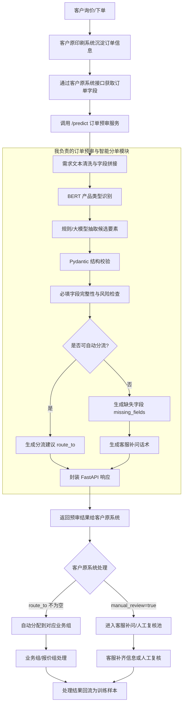
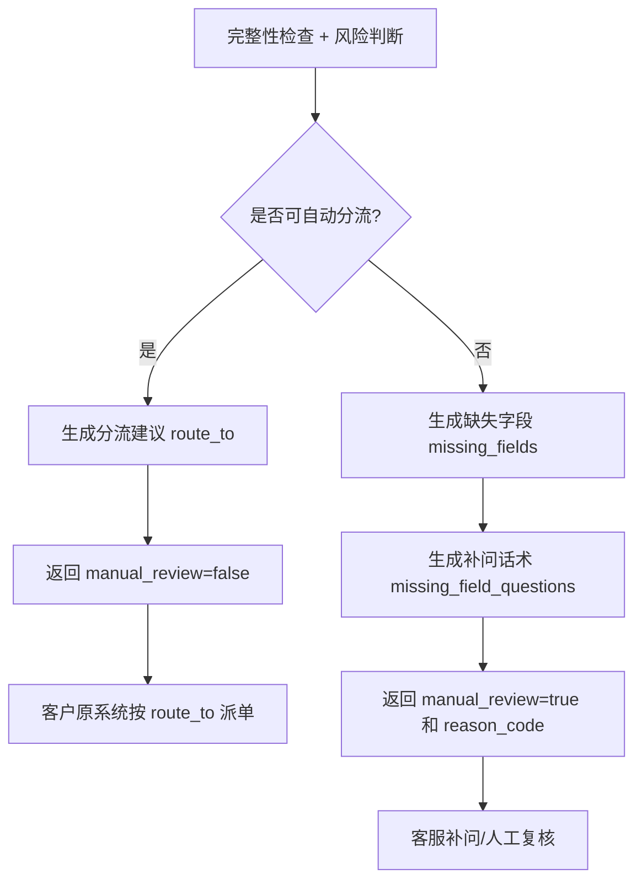
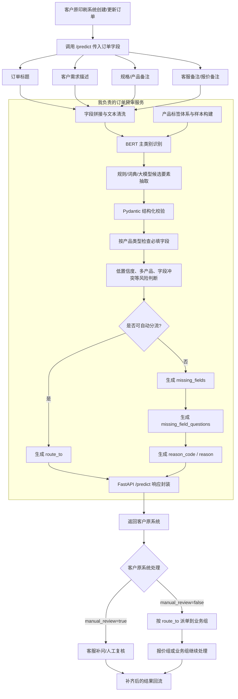

# 面向印刷企业的订单预审与智能分单系统

## 1. 项目定位升级

本项目定位为面向印刷企业的订单预审与智能分单系统。相比单纯的文本分类，本版本更强调印刷企业真实接单流程：客户提交需求后，系统先使用 BERT 微调模型识别产品类型，再通过规则、行业词典或大模型辅助抽取关键工艺要素，使用 Pydantic 对结构化结果进行字段约束和类型校验，检查报价和流转所需参数是否完整，最后由规则决策层决定自动分流还是转人工处理。

核心能力可以概括为：

```text
订单预审 + BERT 产品分类 + 大模型要素抽取 + Pydantic 结构校验 + 参数完整性检查 + 业务分流 + 人工兜底
```

项目不直接控制印刷设备，也不做完整 ERP/MES 系统，而是作为订单系统、客服系统、报价系统前面的智能预处理模块，帮助业务人员更快判断订单类型、补齐关键信息并分配给合适的业务组。

当前技术口径建议保持清晰分工：BERT 负责固定标签下的产品类型分类；规则、词典和可选大模型负责从订单文本中抽取候选要素；Pydantic 负责把候选结果校验成稳定字段结构；最终是否自动分流由确定性的规则决策层判断。云端大模型可以增强长文本理解和补问话术生成，但不直接接管最终分流决策。

## 2. 业务背景

本项目的数据来源统一收敛为：**客户原印刷系统提供的信息接口**。客户的询价、下单和客服沟通会先沉淀到原系统中，形成订单标题、客户需求描述、规格备注、客服备注、报价备注、最终产品类型或业务组处理结果等字段。本项目不直接抓取微信聊天记录，也不直接访问客户数据库，而是通过客户原系统接口获取这些订单字段，再做文本清洗、字段拼接、产品分类、要素抽取和完整性检查。训练阶段使用历史已完成订单构建样本，线上预测阶段使用新订单接口数据做实时预审。客户表达通常不标准，例如：

- 想做一批彩盒，要覆膜烫金，数量 3000 个。
- 印 500 本培训手册，A4，黑白内页，胶装。
- 做一批不干胶标签，贴在食品包装上。
- 需要 5000 份产品说明书，A5，黑白双面，三折页。
- 做一批三联送货单，需要编号，能不能打孔。

实际接单时，客服并不是只判断“这是哪一类产品”，还要进一步判断客户是否提供了报价所需的关键信息。例如包装盒通常需要数量、尺寸、材质、工艺；画册通常需要尺寸、页数、纸张、装订方式；说明书通常需要尺寸、页数、折页或装订方式、颜色要求。

如果这些信息缺失，订单即使分类正确，也不能直接进入报价或生产流转。因此，本项目将“文本分类”扩展为“订单预审”，让系统在分类之外进一步辅助客服补问信息和分流工单。

单纯培训客服可以缓解接单问题，但难以保证每一单都稳定执行同一套标准。印刷产品品类多、参数多，不同产品的必问字段不同；客服在面对大量口语化咨询、并发聊天和新员工上手场景时，仍可能出现漏问、问错或不同客服口径不一致的问题。本项目的价值不是替代客服培训，而是把接单规范固化成系统化检查流程：每一单都自动判断产品类别、检查缺失字段、提示补问内容，并把完整订单分流到对应业务组。

## 3. 订单预审流程

订单预审流程从客户询价或下单开始，系统先处理文本需求，再做风险前置拦截。只有类别明确、模型置信度达标、关键参数完整且不存在拆单或冲突风险时，才允许自动分流；否则统一进入人工处理池。



流程说明：

- 客户原系统负责接收订单、保存订单状态和执行实际派单；本项目负责中间的预审判断、分流建议和接口输出。
- 需求文本来自客户原系统接口传入的订单标题、客户需求描述、规格备注、客服备注、报价备注等字段。
- 产品类型识别由 BERT 微调模型完成，输入订单文本，输出 `pred_class` 和 `confidence`；`confidence` 通常来自分类层 softmax 后 top1 类别概率。
- 如果接口字段中包含较长的历史沟通备注，可以先用规则或大模型整理出和订单需求相关的句子，再送入 BERT 分类，减少无关上下文干扰。
- 工艺要素抽取用于识别数量、尺寸、材质、颜色、后道工艺、装订方式、交期等信息。第一版可用正则和行业词典，复杂口语化表达可由大模型辅助抽取候选字段。
- Pydantic 结构校验用于统一抽取字段，避免后续规则面对格式不稳定的输出。
- 完整性与风险检查用于判断订单是否具备进入报价或分流的基础条件，核心依据是 `REQUIRED_FIELDS`、置信度阈值和异常风险标记。
- 如果模型置信度低、类别冲突、参数缺失、字段矛盾或需要拆单，接口返回 `manual_review=true`、`reason_code` 和补问信息，由客户原系统转入人工处理。

## 4. 产品分类与标签定义

项目仍采用单标签多分类结构，标签需要能和业务组、报价规则或常见产品线对应。

| 标签 | 业务含义 | 典型客户描述 | 常见分流方向 |
| --- | --- | --- | --- |
| 画册印刷 | 企业画册、产品目录、招商手册等多页彩印材料 | 做一本公司产品画册，A4，铜版纸，彩印 | 商务印刷报价组 |
| 包装盒印刷 | 彩盒、礼盒、纸盒、食品盒、化妆品盒等包装类订单 | 定制一批彩盒，要求覆膜、烫金、压痕 | 包装结构/刀模/报价组 |
| 标签/不干胶 | 商品标签、贴纸、瓶贴、条码标签、防伪标签等 | 做食品包装上的不干胶标签，防水材质 | 标签材料与模切组 |
| 书刊印刷 | 图书、教材、培训手册、期刊、资料册等 | 印 500 本培训手册，黑白内页，胶装 | 出版印刷报价组 |
| 说明书印刷 | 产品说明书、使用指南、安装手册、折页说明等 | 印 5000 份产品说明书，A5，三折页 | 说明书/折页工艺组 |
| 宣传单页 | DM 单、宣传页、折页、活动传单等 | 印一批 A4 宣传单，双面彩印，三折页 | 商务印刷报价组 |
| 海报展架 | 海报、易拉宝、展架、展板、KT 板等展示物料 | 活动现场需要海报和易拉宝 | 广告物料组 |
| 名片卡券 | 名片、会员卡、优惠券、门票、卡片等 | 做 1000 张名片，覆膜，双面印刷 | 商务印刷报价组 |
| 票据单据 | 收据、联单、送货单、合同单据、无碳复写纸等 | 做三联送货单，需要编号和打孔 | 联单票据组 |
| 礼品包装 | 手提袋、贺卡、礼品袋、礼盒外包装等礼品物料 | 定制节日礼品手提袋和贺卡 | 礼品包装业务组 |

标签原则：

- 每条订单样本只标一个主类别。
- 如果客户描述多个产品，以主要询价对象或报价主体为准。
- 工艺词如覆膜、烫金、胶装、三折页不单独作为类别，只作为工艺要素。
- 模型判断不清楚时，不强行自动分类，直接进入人工处理。

为什么分类环节使用 BERT，而不是只用简单规则：

简单规则适合判断“有没有数量、有没有尺寸、有没有材质”，但很难稳定判断客户到底要做哪类印刷品。订单预审的第一步是识别主产品类别，因为不同类别对应的必填字段不同：包装盒要检查结构和刀模，说明书要检查页数或折页方式，票据单据要检查联数、编号和打孔要求。如果第一步类别判断不稳，后面的完整性检查规则也会选错。

纯关键词规则还会遇到大量口语化和隐含表达。例如客户可能说“装护肤品的小盒子”，但不直接说“包装盒”；说“贴在瓶身上的防水贴”，但不直接说“不干胶标签”；说“500 本培训资料，A4，胶装”，但不直接说“书刊印刷”。这些场景可以靠同义词规则覆盖一部分，但规则表会越来越长，并且当多个产品词或工艺术语同时出现时容易冲突。BERT 微调模型可以利用上下文语义学习这些表达和标签之间的关系，减少纯规则枚举压力。

因此本项目不是用 BERT 替代规则，而是让两者分工：BERT 负责固定标签下的产品主类别识别，规则负责字段完整性检查、风险兜底和分流决策。对于老客户这类参数完整的订单，BERT 给出类别和置信度后，规则层可以快速校验并自动分流；对于新客户这类表达模糊、参数不完整的订单，BERT 先判断业务大方向，规则层再告诉客服缺哪些字段、应该如何补问。

## 5. 工艺要素抽取

工艺要素抽取不是替代分类模型，而是在分类结果基础上补充业务字段，帮助客服和报价人员判断订单是否能继续流转。当前建议采用“两层抽取”口径：常规订单优先使用正则和行业词典抽取数量、尺寸、材质、颜色、工艺等显式字段；长文本、口语化描述或隐含表达可以调用大模型生成候选字段。无论字段来自规则还是大模型，后续都必须经过 Pydantic 结构校验和规则层完整性检查。

大模型在这里的定位是辅助理解，不是最终裁判。它可以把“装护肤品的小盒子”“表面看起来高级一点”这类表达整理为候选字段，但不能自行编造客户没有明确提供的数量、精确尺寸、材质或具体工艺。

| 要素 | 说明 | 示例 |
| --- | --- | --- |
| 产品类型 | 客户要做的印刷品 | 包装盒、画册、说明书、不干胶标签 |
| 数量 | 订单数量 | 3000 个、500 本、5000 份 |
| 尺寸 | 成品尺寸或规格 | A4、A5、210mm x 285mm |
| 材质 | 纸张或材料 | 铜版纸、白卡纸、牛皮纸、不干胶材料 |
| 颜色 | 印刷颜色要求 | 彩色、黑白、双面彩印 |
| 后道工艺 | 印后加工要求 | 覆膜、烫金、压痕、模切、打孔 |
| 装订方式 | 多页产品的装订要求 | 胶装、骑马钉、折页 |
| 交期 | 客户期望交付时间 | 明天、三天内、一周 |

### 5.1 通用字段与产品专属字段

要素抽取不是所有产品使用完全相同的字段。系统先抽取通用字段，例如产品类型、数量、尺寸、材质、颜色、工艺和交期；再根据 BERT 预测出的 `pred_class` 加载对应的产品专属字段 Schema。包装盒需要关注结构要求、刀模和盒型；标签/不干胶需要关注形状、卷装/张装和防水要求；票据单据需要关注联数、编号和打孔；说明书需要关注页数、折页方式和纸张。这样可以避免用一套过粗的字段覆盖所有印刷品，也能解释为什么必须先做产品类型分类。

技术实现上不建议把所有产品字段拼成一个巨大的 Pydantic 模型，而是采用“基础 Schema + 产品专属 Schema”的继承式结构。`BaseOrderElements` 负责数量、尺寸、材质、颜色、工艺、交期等公共字段；`PackagingBoxElements`、`LabelElements`、`ManualElements`、`ReceiptElements` 等专属模型继承基础模型，并扩展各自的业务字段。BERT 输出 `pred_class` 后，系统通过 `SCHEMA_MAP[pred_class]` 选择对应的 Pydantic 模型做结构校验。

| 产品类型 | 通用字段 | 产品专属字段 |
| --- | --- | --- |
| 包装盒印刷 | 数量、尺寸、材质、颜色、工艺、交期 | 结构要求、刀模、盒型、展开尺寸 |
| 标签/不干胶 | 数量、尺寸、材质、颜色、工艺、交期 | 形状、卷装/张装、防水要求、模切方式 |
| 说明书印刷 | 数量、尺寸、材质、颜色、工艺、交期 | 页数、折页方式、装订方式、纸张 |
| 票据单据 | 数量、尺寸、材质、颜色、工艺、交期 | 联数、编号、打孔、无碳复写纸要求 |
| 书刊印刷 | 数量、尺寸、材质、颜色、工艺、交期 | 页数、封面纸张、内页纸张、装订方式 |

抽取样例：

```json
{
  "text": "客户要印5000份产品说明书，A5尺寸，黑白双面，三折页，三天内要",
  "extracted_elements": {
    "product": "说明书",
    "quantity": "5000份",
    "size": "A5",
    "color": "黑白双面",
    "process": "三折页",
    "deadline": "三天内"
  }
}
```

复杂口语化抽取样例：

```json
{
  "text": "我们想做一批装护肤品的小盒子，大小跟苹果手机盒差不多，表面看起来高级一点，先报个价。",
  "extracted_elements": {
    "product": "包装盒",
    "quantity": null,
    "size": "类比苹果手机盒，未给出准确尺寸",
    "material": null,
    "color": null,
    "process": "高级感，具体工艺未明确",
    "structure_requirement": null,
    "uncertain_fields": ["size", "process"]
  }
}
```

大模型辅助抽取只作为增强能力，不在文档中展开完整提示词。实现时需要遵守三个约束：

- 只抽取客户文本中明确出现或能从上下文合理归纳的信息，不编造数量、尺寸、材质、工艺、页数、交期等字段。
- 对“高级一点”“差不多”“像手机盒大小”这类模糊表达，只保留原文候选值，并把字段加入 `uncertain_fields`，后续由客服补问确认。
- 字段结构和接口响应统一在第 11 节使用 Pydantic 定义，避免同一份文档重复维护 Schema。

### 5.2 大模型抽取结果的校验与重试

大模型生成的 JSON 不一定每次都能通过 Pydantic 校验，例如字段名拼错、类型不对或返回了嵌套对象。对于这种情况，系统不会直接丢弃结果转人工，而是先尝试一次纠错重试：

```text
订单文本 → 大模型抽取 → Pydantic 校验
                              ↓ 失败
                    拼接错误信息到提示词 → 大模型重新生成 → Pydantic 再校验
                                                              ↓ 还失败
                                                         转人工处理
```

实现逻辑：

```python
from pydantic import ValidationError


def extract_with_retry(text: str, pred_class: str, max_retries: int = 1) -> BaseOrderElements | None:
    schema = SCHEMA_MAP.get(pred_class, BaseOrderElements)
    prompt = build_extraction_prompt(text, pred_class)

    for attempt in range(max_retries + 1):
        raw_output = call_llm(prompt)

        try:
            return schema.model_validate_json(raw_output)
        except ValidationError as e:
            if attempt < max_retries:
                error_hint = format_validation_errors(e)
                prompt += f"\n\n上一次输出校验失败，错误信息：{error_hint}\n请严格按照字段要求重新生成。"
            else:
                return None
```

设计要点：

- 只重试一次。如果大模型看到错误信息后仍然生成不合法的结构，继续重试没有意义，直接返回 `None`，由调用方设置 `manual_review=true`。
- 拼接给大模型的错误信息要简洁，只包含字段名和错误类型（例如"copies 字段期望 str 类型，实际收到 dict"），不要把完整 traceback 塞进提示词。
- 这个重试只针对大模型抽取场景。规则和词典抽取的结果结构由代码控制，不会出现格式错误。
- 如果第一次校验就通过了，不会触发重试，不影响正常请求的延迟。

业务解释：

- BERT 分类模型负责判断订单主类别，例如 `说明书印刷` 或 `包装盒印刷`。
- 要素抽取负责把客户文本里的关键参数结构化；规则适合抽取显式字段，大模型适合辅助处理长文本和模糊表达。
- Pydantic 不直接理解自然语言，也不直接代替正则或大模型；它负责校验抽取后的字段名称、类型和默认值是否符合业务约定。产品专属 Pydantic Schema 负责字段边界，避免包装盒订单携带票据字段、票据订单携带标签字段。
- 结构化参数用于后续完整性检查和分流判断。
- 如果关键参数抽取不到，不代表分类模型失败，但后续应转人工补问。

## 6. 信息完整性检查

信息完整性检查用于判断订单是否具备进入报价或业务分流的基础条件。它不替代报价人员判断，只负责把“缺什么信息”明确输出，方便客服补问或业务人员复核。

| 产品类型 | 必查字段 | 允许的等价表达 | 缺失后的处理 |
| --- | --- | --- | --- |
| 包装盒印刷 | 数量、尺寸、材质、工艺、结构要求 | 尺寸可表达为长宽高、展开尺寸或成品规格 | 转人工补问尺寸、材质、工艺和是否已有刀模/结构图 |
| 画册印刷 | 数量、尺寸、页数、纸张、颜色、装订方式 | 尺寸可用 A4/A5，纸张可用铜版纸/哑粉纸等 | 转人工补问页数、纸张克重和装订方式 |
| 标签/不干胶 | 数量、尺寸、材质、形状、交付形式 | 交付形式包括卷装、张装、单张模切 | 转人工补问材质、尺寸、形状和卷装/张装 |
| 书刊印刷 | 数量、开本或尺寸、页数、内页颜色、装订方式 | 开本可替代尺寸，内页颜色可为黑白/彩色 | 转人工补问页数、内页颜色和装订方式 |
| 说明书印刷 | 数量、尺寸、页数或折页方式、颜色、纸张 | 折页说明书可用折页方式替代页数 | 转人工补问折页/装订方式和纸张信息 |
| 宣传单页 | 数量、尺寸、单面或双面、纸张、折页方式 | 不折页时折页方式可标记为无 | 转人工补问纸张、单双面和折页方式 |
| 海报展架 | 数量、尺寸、材质、是否含展架 | 海报、易拉宝、KT 板属于不同物料形态 | 转人工补问尺寸、材质和物料类型 |
| 名片卡券 | 数量、尺寸、材质、单面或双面、工艺 | 标准名片尺寸可作为默认候选，但仍需确认 | 转人工补问材质、单双面和工艺 |
| 票据单据 | 数量、联数、尺寸、编号、是否打孔 | 三联、二联可识别为联数 | 转人工补问联数、编号和打孔要求 |
| 礼品包装 | 数量、尺寸、材质、产品形态、工艺 | 产品形态包括手提袋、贺卡、礼盒外包装 | 转人工补问产品形态、材质和工艺 |

完整性检查的输出建议固定为三个字段：

```json
{
  "missing_fields": ["paper"],
  "missing_field_questions": ["请确认说明书使用的纸张类型或克重，例如 80g 双胶纸、128g 铜版纸。"],
  "reason_code": "MISSING_FIELDS"
}
```

常见缺失字段可以直接生成补问话术：

| 缺失字段 | 补问话术示例 |
| --- | --- |
| 数量 | 请确认本次需要印刷的数量。 |
| 尺寸 | 请确认成品尺寸，或者提供长宽高/展开尺寸。 |
| 材质/纸张 | 请确认使用的纸张或材料，例如铜版纸、白卡纸、不干胶材料。 |
| 页数 | 请确认总页数，是否包含封面封底。 |
| 颜色 | 请确认黑白、彩色、单面还是双面印刷。 |
| 工艺 | 请确认是否需要覆膜、烫金、压痕、模切、打孔等后道工艺。 |
| 装订方式 | 请确认胶装、骑马钉、折页或其他装订方式。 |

完整性判断规则：

```text
产品类别明确 + 关键参数齐全 + 置信度达标 → 自动分流
产品类别明确 + 关键参数缺失 → 转人工补问，并返回缺失字段和补问话术
产品类别不明确或存在类别冲突 → 转人工判断
模型置信度低或 top2 类别差距过小 → 转人工处理
```

置信度阈值可以在演示阶段先采用保守口径：`confidence >= 0.80` 才允许自动分流；`0.60 <= confidence < 0.80` 进入人工复核；`confidence < 0.60` 直接标记为低置信度。真实上线时，阈值应结合验证集表现和错分成本调整，而不是固定写死。

完整性检查使用的必填字段来自对应产品 Schema，而不是所有产品共用一套字段。BERT 先识别主产品类别，规则层再根据该类别加载 `REQUIRED_FIELDS`，检查该类订单进入报价或业务分流前必须具备的参数。

这里需要区分两个职责：产品专属 Pydantic Schema 负责“字段结构和字段边界”，`REQUIRED_FIELDS` 负责“业务必填”。因此 Pydantic 校验通过只表示输出结构合法，不代表订单参数完整；缺哪些字段仍由完整性检查统一生成 `missing_fields` 和补问话术。

规则表可以用代码形式维护：

```python
REQUIRED_FIELDS = {
    "包装盒印刷": ["quantity", "size", "material", "process", "structure_requirement"],
    "画册印刷": ["quantity", "size", "pages", "material", "color", "binding"],
    "标签/不干胶": ["quantity", "size", "material", "shape", "delivery_form"],
    "书刊印刷": ["quantity", "size", "pages", "color", "binding"],
    "说明书印刷": ["quantity", "size", "color", "process", "material"],
    "宣传单页": ["quantity", "size", "color", "material", "process"],
    "海报展架": ["quantity", "size", "material"],
    "名片卡券": ["quantity", "size", "material", "color", "process"],
    "票据单据": ["quantity", "copies", "size", "numbering", "punching"],
    "礼品包装": ["quantity", "size", "material", "product_form", "process"],
}


def check_required_fields(pred_class: str, elements: dict) -> list[str]:
    required = REQUIRED_FIELDS.get(pred_class, [])
    return [
        field for field in required
        if elements.get(field) in (None, "", [])
    ]
```

## 7. 业务分流规则

分流规则要和印刷企业内部岗位或业务组对应，避免只写成“转给生产部门”这种泛化表述。

| 预测类别 | 自动分流目标 | 分流依据 |
| --- | --- | --- |
| 包装盒印刷 | 包装结构/刀模/报价组 | 包装类订单通常涉及结构、材质、工艺和报价 |
| 画册印刷 | 商务印刷报价组 | 画册属于常见商务印刷品 |
| 标签/不干胶 | 标签材料与模切组 | 标签类订单通常关注材料、形状和模切 |
| 书刊印刷 | 出版印刷报价组 | 书刊类订单关注页数、装订和批量 |
| 说明书印刷 | 说明书/折页工艺组 | 说明书可能涉及折页、骑马钉或简单装订 |
| 宣传单页 | 商务印刷报价组 | 宣传单页以纸张、尺寸、单双面和折页为主 |
| 海报展架 | 广告物料组 | 展示物料和普通纸品报价口径不同 |
| 名片卡券 | 商务印刷报价组 | 名片卡券属于小尺寸商务印刷品 |
| 票据单据 | 联单票据组 | 票据类订单涉及联数、编号、打孔等 |
| 礼品包装 | 礼品包装业务组 | 礼品物料关注材质、形态和工艺 |

自动分流不是先分流再纠错，而是先做风险前置拦截。必须同时满足以下条件，才允许生成 `route_to`：

```text
manual_review = false
missing_fields = []
confidence >= threshold
类别无冲突
无需拆单
```

分流结果只表示订单下一步应该交给哪个业务组预审或报价，不表示系统已经完成报价、排产或生产确认。如果模型判断不稳定，或者抽取信息不足，不进入自动分流，统一进入人工处理池。

分流决策层建议使用确定性代码实现，而不是让大模型直接判断。核心原因是分流属于业务风控，需要可解释、可复现、可测试。大模型可以辅助抽取字段和生成补问话术，但最终 `route_to` 和 `manual_review` 由规则函数产生。

### 7.1 我负责的分支输出

“是否可自动分流”这一段属于本项目负责的业务决策输出，但边界要说清楚：本项目负责判断和生成建议，客户原系统负责真正修改订单状态、派单和人工处理。

| 分支 | 判断含义 | 本项目负责输出 | 客户原业务系统负责 |
| --- | --- | --- | --- |
| 是：可自动分流 | 类别明确、置信度达标、关键参数齐全且无风险 | `manual_review=false`、`route_to`、`pred_class`、`confidence`、结构化字段 | 根据 `route_to` 把订单分配到对应报价组或业务组 |
| 否：不可自动分流 | 信息缺失、置信度低、类别冲突、多产品或字段矛盾 | `manual_review=true`、`missing_fields`、`missing_field_questions`、`reason_code`、`reason` | 客服补问客户，或把订单放入人工复核池 |



```python
ROUTE_MAP = {
    "包装盒印刷": "包装结构/刀模/报价组",
    "画册印刷": "商务印刷报价组",
    "标签/不干胶": "标签材料与模切组",
    "书刊印刷": "出版印刷报价组",
    "说明书印刷": "说明书/折页工艺组",
    "宣传单页": "商务印刷报价组",
    "海报展架": "广告物料组",
    "名片卡券": "商务印刷报价组",
    "票据单据": "联单票据组",
    "礼品包装": "礼品包装业务组",
}


def build_manual_result(reason_code: str, reason: str, missing_fields: list[str]) -> dict:
    return {
        "manual_review": True,
        "route_to": None,
        "reason_code": reason_code,
        "reason": reason,
        "missing_fields": missing_fields,
    }


def decide_route(pred_class: str | None, confidence: float, elements: dict, risks: dict) -> dict:
    missing_fields = check_required_fields(pred_class, elements) if pred_class else []

    if not pred_class:
        return build_manual_result("UNKNOWN_CLASS", "无法判断订单主类别", missing_fields)
    if confidence < 0.80:
        return build_manual_result("LOW_CONFIDENCE", "模型置信度不足，需要人工确认产品类别", missing_fields)
    if risks.get("multi_product"):
        return build_manual_result("MULTI_PRODUCT", "同一需求包含多个产品，需要人工拆单", missing_fields)
    if risks.get("class_conflict"):
        return build_manual_result("AMBIGUOUS_CLASS", "类别线索冲突，需要人工复核", missing_fields)
    if risks.get("element_conflict"):
        return build_manual_result("CONFLICTED_ELEMENTS", "抽取字段存在矛盾，需要人工确认", missing_fields)
    if missing_fields:
        return build_manual_result("MISSING_FIELDS", "关键报价参数缺失，需要客服补问", missing_fields)

    return {
        "manual_review": False,
        "route_to": ROUTE_MAP.get(pred_class),
        "reason_code": None,
        "reason": None,
        "missing_fields": [],
    }
```

## 8. 人工兜底策略

本项目不强调模型全自动替代人工，而是把模型作为订单前置筛选工具。人工兜底不只返回 `manual_review=true`，还需要说明原因，方便客服知道下一步要补问还是复核类别。

| 兜底原因 | reason_code | 处理方式 |
| --- | --- | --- |
| 模型置信度低 | LOW_CONFIDENCE | 转人工判断产品类别 |
| top2 类别接近或类别冲突 | AMBIGUOUS_CLASS | 转人工复核主类别 |
| 关键参数缺失 | MISSING_FIELDS | 生成缺失字段和补问话术 |
| 客户描述过短 | TOO_SHORT_TEXT | 转人工补充需求描述 |
| 同一文本包含多个跨类别产品 | MULTI_PRODUCT | 拆单或人工确认主询价对象 |
| 抽取字段互相矛盾 | CONFLICTED_ELEMENTS | 转人工确认冲突字段 |
| 不属于当前印刷产品范围 | OUT_OF_SCOPE | 转人工或转其他业务入口 |

多产品订单需要单独处理：

- 如果多个产品属于同一业务类别，例如“海报和易拉宝”，可以归入 `海报展架`，但仍要分别检查尺寸、数量和材质是否完整。
- 如果多个产品跨业务类别，例如“包装盒和说明书一起做”，不强行选择一个自动分流目标，进入人工处理，由客服拆成多个询价项或确认主报价对象。
- 如果文本里有明确主次，例如“主要做包装盒，顺带问说明书价格”，可以标记主类别为 `包装盒印刷`，同时保留 `related_products` 供人工复核。

简化后的业务规则：

```text
模型可靠 + 类别单一 + 信息完整 → 自动分流
模型不可靠 / 类别冲突 / 信息缺失 / 需要拆单 → 转人工处理
```

这种设计适合印刷业务，因为错分订单可能影响报价口径、沟通成本和交期判断。把不确定样本交给人工，更符合实际接单流程。

## 9. 上线对接与职责边界

上线阶段建议把本项目部署为独立的订单预审服务，放在客户原印刷系统和报价分单流程之间。客户原系统负责接收订单、维护订单状态和执行实际业务流转，本项目通过接口读取订单字段，对订单文本做智能预审，并把可解释的分流建议或人工补问信息返回给客户原系统。



职责边界建议这样表述：

| 范围 | 本项目负责 | 客户原系统/业务人员负责 |
| --- | --- | --- |
| 订单输入 | 接收客户原系统接口传入的订单标题、需求描述、规格备注、客服备注、报价备注等字段 | 采集客户需求、维护订单主数据并提供接口 |
| 预审判断 | 分类、要素抽取、字段校验、完整性检查、风险判断 | 判断特殊业务是否需要额外流程 |
| 自动分流 | 生成 `route_to` 和 `manual_review=false` | 根据 `route_to` 执行实际派单 |
| 人工兜底 | 生成 `missing_fields`、`missing_field_questions`、`reason_code` | 客服补问客户，业务人员复核复杂订单 |
| 数据回流 | 接收人工修正结果作为后续训练样本 | 提供最终产品类别、报价组、人工处理结果 |

因此，简历或答辩中可以说：我负责的是订单进入报价和分单前的智能预审模块，不直接控制客户原有 ERP/MES，不直接报价，也不直接排产。模型服务只输出可解释的分类、字段检查和分流建议，最终业务动作仍由客户原系统和人工流程完成。

### 客户内部部署配置建议

本项目面向客户内部客服和接单系统使用，不是直接暴露给公网的大规模高并发服务，因此推荐优先采用简单稳定的共部署方案。如果客户原有订单系统已经部署在内部服务器上，并且服务器资源为 **8 核 CPU、16GB 内存、SSD 磁盘**，可以把本项目作为独立 FastAPI 子服务部署在同一台服务器上。

推荐部署结构如下：

```text
客户现有服务器
├── 原订单系统
│   └── 负责订单管理、状态流转、派单和业务数据维护
├── 订单预审 FastAPI 服务
│   ├── /predict 订单预审接口
│   ├── BERT 产品分类
│   ├── 规则/词典要素抽取
│   ├── Pydantic 结构校验
│   └── route_to / manual_review 分流建议
└── Nginx
    ├── 转发原订单系统请求
    └── 转发或保护订单预审服务接口
```

初期建议使用 CPU 推理，不强制要求 GPU。BERT 模型在 FastAPI 服务启动时加载一次并常驻内存，`/predict` 接口收到客户原系统传入的新订单后，同步完成单条推理、要素抽取、完整性检查和分流判断。由于客户内部订单预审通常来自原系统接口，调用频率相对可控，8 核 16GB 的普通业务服务器可以满足初期使用。

服务启动示例：

```bash
uvicorn app:app --host 127.0.0.1 --port 8001 --workers 1
```

这里建议初期设置 `workers=1`，原因是每个 worker 都会加载一份 BERT 模型，多 worker 会重复占用内存。对于客户内部订单预审场景，单 worker 更稳，也能减少对原订单系统、数据库或其他业务服务的资源影响。原订单系统可以通过内网地址调用：

```text
http://127.0.0.1:8001/predict
```

为了上线更稳，建议同时加入以下保护：

| 配置项 | 建议做法 | 作用 |
| --- | --- | --- |
| 输入长度限制 | 限制订单文本最大长度，例如 1500 字以内 | 避免超长聊天记录拖慢推理 |
| 请求超时 | 设置接口超时时间 | 避免异常请求长期占用服务 |
| 健康检查 | 提供 `/health` 接口 | 便于 Nginx、运维脚本或监控检查服务状态 |
| 内网访问 | FastAPI 监听 `127.0.0.1` 或内网地址 | 避免模型接口直接暴露公网 |
| 异常兜底 | 推理失败时返回 `manual_review=true` | 保证业务流程不中断 |

面试或答辩被问到服务器配置时，可以这样回答：

> 这个项目是客户内部订单预审和分类服务，不是面向公网的大规模高并发系统，所以服务器配置不需要特别夸张。比较合适的是部署在客户现有的 8 核 CPU、16GB 内存服务器上，使用 CPU 推理即可，不一定需要 GPU。

如果继续追问为什么 8 核 16GB 够用，可以补充：

> 因为 BERT 模型不是每次请求都重新加载，而是在 FastAPI 服务启动时加载一次并常驻内存。实际订单分类时，请求只需要调用已经加载好的模型完成一次前向推理。客户原系统通常按新订单或订单更新触发单条同步调用，所以 8 核 16GB 的服务器可以满足初期使用。

如果追问怎么和客户原系统部署在一起，可以回答：

> 我会把这个项目作为独立 FastAPI 子服务部署在客户原系统所在的内网服务器上，比如监听本机 `8001` 端口。原来的订单系统继续负责订单管理、状态流转和派单，我的服务只提供 `/predict` 接口。原系统通过内网调用这个接口，拿到分类结果、置信度、缺失字段和分流建议后，再继续自己的业务流程。

如果追问并发或扩展，可以回答：

> 初期我会使用 `workers=1`，避免多个 worker 重复加载 BERT 占用过多内存，也避免影响原来的业务系统。外层可以用 Nginx 做反向代理，统一转发到 FastAPI 服务。同时加 `/health` 健康检查、输入长度限制、请求超时和异常兜底。如果后面订单量增长，再考虑增加 worker、拆到单独服务器，或者改成小 batch 推理。

## 10. 数据样例与标注规则

训练样本来自客户原系统中已经处理完成的历史订单。历史订单通过接口或导出文件获取后，先清洗无效记录，再把订单标题、客户需求描述、规格备注、客服备注、报价备注等字段拼接成训练文本，并将最终产品类型或业务组处理结果统一映射为标准标签。详细的数据来源、数据量、类别分布和指标口径见 `印刷行业项目数据来源与指标说明.md`。

### 10.1 训练数据样例

| text | label |
| --- | --- |
| 客户需要定制一批彩色包装盒，3000 个，要求覆膜、烫金，交期一周 | 包装盒印刷 |
| 想做 500 本企业培训手册，A4，黑白内页，胶装 | 书刊印刷 |
| 食品包装上要贴的不干胶标签，需要防水材质 | 标签/不干胶 |
| 做一批 A4 宣传折页，双面彩印，三折页 | 宣传单页 |
| 公司新品发布会需要海报和易拉宝，尺寸帮忙推荐 | 海报展架 |
| 需要印三联送货单，带编号，最好可以打孔 | 票据单据 |
| 客户要印 5000 份产品说明书，A5，黑白双面，三折页 | 说明书印刷 |

### 10.2 标注规则

| 规则 | 说明 |
| --- | --- |
| 主产品优先 | 多个产品同时出现时，以主要询价对象作为标签 |
| 工艺不作为标签 | 覆膜、烫金、胶装、折页等只作为辅助工艺要素 |
| 说明书单独成类 | 产品说明书、安装手册、使用指南统一标为 `说明书印刷` |
| 类别不清转人工 | 难以判断的样本不强行标注，进入人工复核 |
| 标签口径固定 | 统一使用标签表中的标准标签，不临时新增别名 |

## 11. FastAPI 接口设计

FastAPI 负责把模型预测、要素抽取、完整性检查和分流结果封装成标准 HTTP 接口，方便客户原印刷系统或演示页面调用。上线对接时建议让客户原系统传入订单 ID 和多个业务字段，服务端再统一拼接成模型输入文本。接口层使用 Pydantic 定义请求体、抽取结果和预审响应模型，让输入校验、输出格式和自动接口文档保持一致。

Pydantic 接口模型示例：

```python
from pydantic import BaseModel, Field


class OrderElements(BaseModel):
    product: str | None = None
    quantity: str | None = None
    size: str | None = None
    material: str | None = None
    color: str | None = None
    process: str | None = None
    binding: str | None = None
    pages: str | None = None
    shape: str | None = None
    delivery_form: str | None = None
    structure_requirement: str | None = None
    copies: str | None = None
    numbering: str | None = None
    punching: str | None = None
    product_form: str | None = None
    deadline: str | None = None
    uncertain_fields: list[str] = Field(default_factory=list)


class PredictRequest(BaseModel):
    order_id: str | None = Field(default=None, description="客户原系统订单 ID，透传用于结果回写")
    text: str = Field(min_length=2, max_length=1500, description="调用方拼接好的订单需求文本")


class PrecheckResponse(BaseModel):
    order_id: str | None = None
    text: str
    pred_class: str | None = None
    confidence: float | None = Field(default=None, ge=0, le=1)
    extracted_elements: OrderElements = Field(default_factory=OrderElements)
    missing_fields: list[str] = Field(default_factory=list)
    missing_field_questions: list[str] = Field(default_factory=list)
    risk_flags: dict[str, bool] = Field(default_factory=dict)
    route_to: str | None = None
    manual_review: bool = False
    reason_code: str | None = None
    reason: str | None = None
```

| 接口 | 方法 | 作用 |
| --- | --- | --- |
| `/health` | GET | 服务健康检查 |
| `/predict` | POST | 输入订单需求文本，返回预审结果 |
| `/docs` | GET | FastAPI 自动接口文档 |

请求示例：

```json
{
  "order_id": "ORD202605140001",
  "text": "包装盒报价 想做一批装护肤品的小盒子，表面高级一点 客户暂未提供尺寸和数量"
}
```

`/predict` 返回的是订单预审结果，不是报价结果，也不是生产指令。调用方负责把订单标题、需求描述、客服备注等字段拼接成一段文本传入，服务端不再做拼接。无论是否允许自动分流，接口都会返回订单 ID、文本、模型类别、置信度、抽取字段和风险标记；区别在于可自动分流时重点返回 `route_to`，不可自动分流时重点返回 `missing_fields`、`missing_field_questions` 和 `reason_code`。

| 判断结果 | 客户原系统判断依据 | 重点输出 | 客户原系统处理 |
| --- | --- | --- | --- |
| 可自动分流 | `manual_review=false` 且 `route_to` 不为空 | `route_to`、`pred_class`、`confidence`、`extracted_elements` | 按 `route_to` 派单到对应业务组 |
| 不可自动分流 | `manual_review=true` 或 `route_to=null` | `missing_fields`、`missing_field_questions`、`reason_code`、`reason` | 客服补问或进入人工复核池 |

可自动分流响应示例：

```json
{
  "order_id": "ORD202605140002",
  "text": "客户要印5000份产品说明书，A5尺寸，黑白双面，三折页，三天内要",
  "pred_class": "说明书印刷",
  "confidence": 0.91,
  "extracted_elements": {
    "product": "说明书",
    "quantity": "5000份",
    "size": "A5",
    "color": "黑白双面",
    "process": "三折页",
    "deadline": "三天内"
  },
  "missing_fields": [],
  "missing_field_questions": [],
  "risk_flags": {},
  "route_to": "说明书/折页工艺组",
  "manual_review": false,
  "reason_code": null,
  "reason": null
}
```

不可自动分流响应示例：

```json
{
  "order_id": "ORD202605140001",
  "text": "客户要做一批包装盒，尽快报价",
  "pred_class": "包装盒印刷",
  "confidence": 0.76,
  "extracted_elements": {
    "product": "包装盒"
  },
  "missing_fields": ["quantity", "size", "material", "process", "structure_requirement"],
  "missing_field_questions": [
    "请确认本次需要制作的包装盒数量。",
    "请确认包装盒成品尺寸或展开尺寸。",
    "请确认包装盒材质，例如白卡纸、灰板纸或牛皮纸。",
    "请确认是否需要覆膜、烫金、压痕、模切等工艺。",
    "请确认是否已有刀模或结构图。"
  ],
  "risk_flags": {},
  "route_to": null,
  "manual_review": true,
  "reason_code": "MISSING_FIELDS",
  "reason": "关键报价参数缺失，转人工补问"
}
```

长文本和隐含表达场景：

```json
{
  "order_id": "ORD202605140003",
  "text": "我们想做一批装护肤品的小盒子，大小跟苹果手机盒差不多，表面看起来高级一点，先报个价。",
  "pred_class": "包装盒印刷",
  "confidence": 0.72,
  "extracted_elements": {
    "product": "包装盒",
    "quantity": null,
    "size": "类比苹果手机盒，未给出准确尺寸",
    "material": null,
    "process": "高级感，具体工艺未明确",
    "structure_requirement": null,
    "uncertain_fields": ["size", "process"]
  },
  "missing_fields": ["quantity", "size", "material", "process", "structure_requirement"],
  "missing_field_questions": [
    "请确认这批包装盒大概需要制作多少个。",
    "请提供包装盒的准确成品尺寸或长宽高。",
    "请确认包装盒使用的纸张或材料，例如白卡纸、灰板纸或牛皮纸。",
    "请确认是否需要覆膜、烫金、压纹、压痕、模切等具体工艺。",
    "请确认是否已有刀模或结构图。"
  ],
  "risk_flags": {
    "multi_product": false,
    "class_conflict": false,
    "element_conflict": false
  },
  "route_to": null,
  "manual_review": true,
  "reason_code": "MISSING_FIELDS",
  "reason": "客户表达较模糊且关键报价参数缺失，需要客服补问"
}
```

接口字段说明：

| 字段 | 含义 |
| --- | --- |
| `order_id` | 客户原系统订单 ID，方便客户原系统回写预审结果 |
| `text` | 服务端拼接后的订单需求文本 |
| `pred_class` | 模型识别出的订单类别 |
| `confidence` | 模型预测置信度 |
| `extracted_elements` | 从文本中抽取出的业务要素 |
| `missing_fields` | 当前产品类型缺失的关键参数 |
| `missing_field_questions` | 根据缺失字段生成的客服补问话术 |
| `risk_flags` | 多产品、类别冲突、字段矛盾等风险标记 |
| `route_to` | 建议分流的业务组 |
| `manual_review` | 是否需要人工处理 |
| `reason_code` | 转人工原因码，例如 `LOW_CONFIDENCE`、`MISSING_FIELDS`、`MULTI_PRODUCT` |
| `reason` | 转人工原因 |

## 12. RandomForest + TF-IDF Baseline 实践

Baseline 仍然采用 `RandomForest + TF-IDF`，用于快速验证印刷订单需求文本是否具备可学习性。训练数据规模、类别分布、清洗过滤规则和示例指标单独放在 `印刷行业项目数据来源与指标说明.md` 中说明，总文档只保留方法路径。

实践流程：

```text
读取订单文本数据
        ↓
清洗文本、统一标签
        ↓
中文分词和停用词过滤
        ↓
TF-IDF 向量化
        ↓
RandomForest 训练分类器
        ↓
评估 Accuracy、Precision、Recall、Macro-F1
        ↓
保存 TF-IDF 向量器和 RandomForest 模型
```

Baseline 在业务上的价值：

- 快速判断标签体系是否合理。
- 找出容易混淆的产品类型，例如画册和书刊、包装盒和礼品包装。
- 提供可解释的关键词特征，便于和业务人员沟通。
- 作为后续 FastText、BERT 的对照组。

## 13. 模型优化路线

| 阶段 | 方法 | 目标 |
| --- | --- | --- |
| Baseline | TF-IDF + RandomForest | 快速验证任务可行性 |
| 轻量模型 | FastText | 提升训练和推理速度 |
| 主分类模型 | BERT 微调 | 提升固定标签下的复杂订单文本识别效果，并输出类别置信度 |
| 要素抽取增强 | 大模型抽取 | 抽取数量、尺寸、材质、工艺等字段，增强长文本和口语化表达处理能力 |
| 业务决策增强 | Pydantic 结构校验 + 完整性检查 + 规则分流决策 | 让分类结果服务接单和报价流程，同时保证分流可解释、可复现 |
| 服务部署 | FastAPI + Pydantic + Streamlit | 提供接口调用和演示页面 |
| 人工兜底 | 低置信度或参数缺失转人工 | 降低错分风险 |

模型优化不是只追求分数，而是让模型输出结果能嵌入业务流程。对印刷订单来说，BERT 类别识别只是第一步，能不能辅助客服判断缺什么信息、该转给哪个组，才是项目包装里的业务价值。大模型的价值主要体现在复杂文本整理、候选字段抽取和补问话术生成，不直接替代 BERT 主分类模型，也不直接接管最终分流决策。

## 14. 简历描述版本

构建面向印刷企业的订单预审与智能分单系统，通过客户原印刷系统信息接口获取订单标题、需求描述、规格备注、客服备注和报价备注等字段，使用 BERT 微调模型自动识别包装盒、画册、标签/不干胶、书刊、说明书、海报等印刷产品类型，并结合正则、行业词典和可选大模型辅助抽取数量、尺寸、材质、颜色、工艺、交期等关键要素。系统使用 Pydantic 对抽取结果和接口响应进行结构化建模与字段校验，在分类结果基础上进行参数完整性检查；信息完整、模型置信度达标且无异常风险时，通过规则决策层生成 `route_to` 分流建议，供客户原系统派单到包装结构/刀模/报价组、标签材料与模切组、说明书/折页工艺组等对应业务组；模型不确定、参数缺失或存在多产品/字段冲突时返回人工处理原因和补问话术。项目完成从客户原系统历史订单数据清洗、TF-IDF + RandomForest baseline、FastText/BERT 建模、要素抽取、Pydantic 结构校验、FastAPI 接口封装到 Streamlit 演示的完整流程。

简历中可以按“四段式”拆开写，避免只堆技术名词：

| 结构 | 本项目写法 |
| --- | --- |
| 项目背景 | 印刷企业客户询价文本口语化、参数不完整，人工预审和分流容易漏问、错分 |
| 个人职责 | 负责标签体系设计、数据清洗、BERT 分类模型验证、要素抽取规则、完整性检查、自动分流/人工兜底分支输出、FastAPI/Streamlit 演示封装 |
| 技术方案 | 使用 TF-IDF + RandomForest 做 baseline，引入 FastText/BERT 提升分类效果；要素抽取采用规则/词典并预留大模型增强，结合 Pydantic、完整性检查和人工兜底输出预审结果 |
| 结果指标 | 可从 Accuracy、Macro-F1、推理延迟、人工复核率、缺失字段命中率等角度说明，演示阶段不要夸成真实线上收益 |

## 15. 答辩讲解版本

这个项目不是单纯把客户文本分成几个类别，而是结合印刷企业接单流程做订单预审。客户的询价和下单信息会先进入原印刷系统，本项目通过客户原系统接口获取订单标题、需求描述、规格备注、客服备注和报价备注等字段。客户需求里经常只说“做一批包装盒”或“印一些说明书”，但没有给出尺寸、数量、材质、页数、工艺等报价必需信息。系统先用 BERT 微调模型识别产品类型，再通过规则、行业词典或可选大模型抽取数量、尺寸、材质、颜色、工艺、交期等候选要素，并用 Pydantic 把抽取结果校验成固定字段结构，然后按不同产品类型检查关键参数是否完整。

如果 BERT 分类置信度达标、类别明确、参数完整且没有多产品或字段冲突，系统会通过规则决策层给出 `route_to` 分流建议，例如包装盒订单建议流转到包装结构/刀模/报价组，说明书订单建议流转到说明书/折页工艺组。客户原系统根据这个结果执行实际派单。如果缺少关键字段，系统不会强行分流，而是返回缺失字段和补问话术，比如缺尺寸就提示客服确认成品尺寸；如果类别冲突、文本过短或同一需求包含多个跨类别产品，则转人工复核。

所以这个项目的重点不是“模型替代人工”，而是把 BERT 分类能力和规则预审能力放在业务前置环节，帮助客服更快完成初筛、补问和分单。大模型可以辅助长文本整理、候选字段抽取和客服话术生成，但最终能不能生成分流建议仍由规则层判断；系统也不负责自动报价、排产或生产调度。

项目讲解时可以按“8 步法”组织：

1. 这是什么项目：面向印刷企业的订单预审与智能分单系统。
2. 为什么做：客户需求文本不标准，报价前关键参数经常缺失，人工分流依赖经验。
3. 我负责什么：标签体系、数据处理、BERT 分类模型验证、要素抽取、完整性检查、自动分流/人工兜底分支输出、接口封装和演示流程。
4. 技术怎么选：先用 RandomForest baseline 验证可行性，再用 FastText 做轻量对照，最后用 BERT 提升固定标签分类效果；要素抽取用规则/词典为主，大模型作为长文本和模糊表达的增强。
5. 怎么落地：通过 FastAPI 提供 `/predict`，返回类别、置信度、抽取字段、缺失字段、风险标记、分流目标和人工兜底原因。
6. 遇到什么问题：客户表达口语化、类别边界容易混淆、分类正确但参数仍不完整。
7. 怎么解决：补充标注规则、做 Pydantic 结构校验和完整性检查，设置置信度阈值、风险原因码和人工兜底。
8. 最终结果与收获：项目不只是分类模型，而是把模型输出嵌入订单预审流程，兼顾效果、延迟、成本和业务风险。

如果面试官追问“为什么要先分类再抽字段”，可以这样回答：

> 因为不同印刷产品适配的工艺和报价参数不一样，不能所有产品都用同一套字段。系统会先用 BERT 判断主产品类别，再加载对应的字段 Schema。所有订单都会抽数量、尺寸、材质、颜色、工艺、交期这些通用字段，但包装盒还要关注结构要求、刀模和盒型，标签要关注形状和卷装/张装，票据要关注联数、编号和打孔，说明书要关注页数和折页方式。先分类再抽字段，后面的完整性检查才有业务意义。

如果面试官追问“是不是把所有字段拼成一个大的 Pydantic 模型”，可以这样回答：

> 不是。把所有产品字段都塞进一个大模型虽然能跑，但业务边界会很乱，包装盒订单会带着票据字段，票据订单也会带着标签字段。我的设计是继承式 Schema：先定义 `BaseOrderElements` 放公共字段，再定义包装盒、标签、说明书、票据等专属模型继承基础模型。BERT 输出 `pred_class` 后，通过 `SCHEMA_MAP` 选择对应的专属 Pydantic 模型校验。Pydantic 负责结构合法和字段边界，`REQUIRED_FIELDS` 再负责判断业务信息是否完整。

如果面试官追问“既然老客户参数完整、新客户多数要补问，为什么不用简单规则系统”，可以这样回答：

> 简单规则可以判断字段有没有填，比如有没有数量、尺寸、材质，但它不擅长判断客户到底要做哪类印刷品。不同产品的必填字段不同，包装盒要看结构和刀模，说明书要看页数或折页，票据要看联数、编号和打孔，所以必须先判断主类别。客户表达又经常不标准，比如“装护肤品的小盒子”“贴瓶身的防水贴”“培训资料胶装”，不一定直接出现标准标签名。BERT 负责理解这些隐含表达并输出主类别和置信度，规则层再根据类别检查字段完整性和分流条件。也就是说，规则适合做确定性校验，BERT 适合做语义分类，两者是组合关系，不是二选一。

如果面试官追问“培训客服不就能解决吗”，可以这样回答：

> 培训客服是必要的，但不能完全保证稳定性。印刷订单品类和参数很多，不同产品要问的字段不一样，包装盒要问结构和刀模，说明书要问页数和纸张，标签要问材质、形状和卷装/张装。客服培训后知道规则，但真实接单时面对大量口语化聊天记录和并发咨询，仍然可能漏问、问错或不同客服口径不一致。我的系统不是替代培训，而是把培训里的接单规范工具化：BERT 先判断产品类别，规则层检查缺哪些字段，再生成补问话术。这样客服不是完全靠记忆接单，而是每一单都有系统辅助检查，尤其能降低新员工上手成本和高峰期漏问风险。

## 16. 边界说明

本项目聚焦订单文本预审和智能分单，不包含以下能力：

- 不直接控制印刷机、切纸机、覆膜机等生产设备。
- 不做图像质检。
- 不做完整 ERP、MES 或生产排程系统。
- 不让模型强制处理所有订单，无法可靠判断的订单全部转人工。
- 不让云端大模型直接决定最终分流结果；大模型只作为要素抽取、长文本整理和补问话术生成的增强模块。

该边界能保证项目能力和现有文本分类技术路线一致，同时通过订单预审、要素抽取、完整性检查和业务分流规则体现印刷行业经验。
