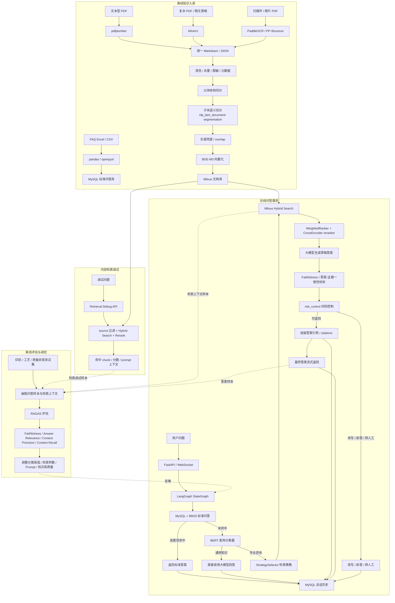

# 印刷企业内部知识库问答系统：项目设计文档

## 1. 项目概述

印刷企业内部知识库问答系统面向客服、印前、售后、生产支持和知识库维护人员，提供企业内部知识检索、标准问答、多轮追问和可控流式回答能力。

系统围绕印前规范、材料工艺、质量异常处理建议等高频业务场景建设，采用“标准问答优先 + BERT 查询分类 + RAG 文档检索 + 大模型生成”的混合问答架构。高频稳定问题由 MySQL 标准问答库直接返回；标准问答未命中时，先通过 BERT 分类判断问题是否需要查询企业知识库；专业问题进入 RAG 链路，基于内部文档检索结果生成回答。

系统定位为内部知识辅助工具，不直接执行报价、订单审核、生产排程、质量责任判定等业务决策。

## 2. 业务背景

印刷企业内部知识通常分散在 FAQ、印前规范、材料工艺手册、售后 SOP、质量异常案例和历史问答记录中。客服、印前、售后和生产支持人员遇到问题时，经常需要翻阅多个文档、询问经验员工或查询历史记录。

主要问题包括：

- 资料分散：PDF、Word、PPT、表格、扫描件等资料存放位置不统一。
- 标准不统一：不同员工对同一问题的解释可能存在差异。
- 新员工学习成本高：印前规范、材料工艺和异常处理依赖经验积累。
- 复杂问题检索困难：质量异常和工艺问题经常需要综合多个文档片段。
- 文档更新后使用效率低：新规范、新案例进入一线查询链路不及时。

行业背景上，国家新闻出版署《印刷业数字化三年行动计划（2025-2027年）》提出要完善贯穿印前、印刷、印后的数据交换和标准体系，提升印刷质量管理数字化水平，建设质检案例数据库，提供风险识别和质量帮扶服务。本系统聚焦企业内部知识服务，是印刷企业知识数字化的一部分。

## 3. 目标用户

| 用户角色 | 主要需求 | 系统价值 |
| --- | --- | --- |
| 客服人员 | 快速解释常见印前和工艺问题 | 降低反复询问成本，提升答复一致性 |
| 印前人员 | 查询文件格式、出血、CMYK、字体转曲、刀模线等要求 | 快速定位规范依据 |
| 售后人员 | 查询色差、覆膜起泡、胶装掉页、模切偏位等异常原因 | 获取排查方向和沟通参考 |
| 生产支持人员 | 查询材料、工艺、产品品类知识 | 辅助理解工艺注意事项 |
| 知识库维护人员 | 维护 FAQ、SOP、工艺手册和质量案例 | 确保知识更新后进入检索链路 |

## 4. 系统范围

### 4.1 包含范围

- 内部知识问答。
- 高频 FAQ 标准回答。
- BERT 查询分类，区分通用知识和专业咨询。
- RAG 文档检索增强。
- 知识域过滤。
- 多轮会话历史。
- WebSocket 流式输出，RAG 答案在服务端完成生成和一致性校验后再返回。
- 文档解析、OCR、清洗、脱敏、切块和向量化入库。
- 印前规范、材料工艺、质量异常处理建议三个主要场景。

### 4.2 不包含范围

- 不自动报价。
- 不做订单预审。
- 不做自动分单。
- 不控制生产设备。
- 不做生产排程。
- 不做质量责任判定。
- 不替代印前、工艺、质检、售后人员做最终结论。
- 不直接处理客户订单交易数据。

## 5. 核心业务场景

### 5.1 印前文件规范查询

典型问题：

- 为什么印刷文件要留出血？
- RGB 文件直接印刷会有什么问题？
- 图片分辨率过低会影响什么？
- 字体为什么要转曲？
- 刀模线文件需要注意什么？

处理方式：

- 高频、标准、答案稳定的问题沉淀到 MySQL 标准问答库。
- 系统通过 BM25 匹配标准问题，高置信命中后直接返回标准答案。
- 未高置信命中时进入 BERT 查询分类，由分类结果决定是否进入 RAG。

可靠性控制：

- 标准问答由业务人员维护。
- BM25 设置高置信阈值，避免相似但不准确的问题被直接返回。
- 未命中时不强行套用相似答案。

### 5.2 材料与工艺知识查询

典型问题：

- 铜版纸和哑粉纸有什么区别？
- 白卡纸适合做哪些印刷品？
- 覆膜和上光有什么区别？
- 烫金适合哪些产品？
- 纸盒为什么需要模切和压痕？

处理方式：

- 材料说明、工艺手册和产品知识文档进入 RAG 文档库。
- 专业问题进入 Milvus 检索，召回相关片段。
- 大模型基于检索上下文组织回答。

可靠性控制：

- 专业回答必须基于企业知识库检索结果，不直接凭模型常识给工艺结论。
- 检索范围、混合检索和精排策略见 [9.3 混合检索](#rag-hybrid-retrieval)。
- 答案引用和来源追溯见 [9.7 答案引用与来源追溯](#answer-citations)。

### 5.3 质量异常处理建议查询

典型问题：

- 印刷色差常见原因有哪些？
- 覆膜起泡可能是什么原因？
- 胶装掉页一般怎么排查？
- 模切偏位可能和哪些环节有关？
- 不干胶标签不粘可能是什么原因？

处理方式：

- 系统提供常见原因、排查方向和内部沟通参考。
- 涉及质量责任、赔付、客户争议时，只提供辅助信息，不给最终责任结论。

可靠性控制：

- 回答中区分“可能原因”“排查方向”“建议人工确认”。
- 检索不到明确依据时，返回无明确依据提示。
- 高风险业务问题转人工处理。

## 6. 总体架构

### 6.1 架构图



### 6.2 在线问答流程

```text
用户提问
  -> FastAPI / WebSocket 接收请求
  -> LangGraph 初始化问答状态
  -> 读取 session_id、allowed_sources、requested_sources
  -> 计算 final_sources = allowed_sources ∩ requested_sources
  -> 加载最近会话历史
  -> MySQL 标准问答库 + BM25 相似问题匹配
  -> 高置信命中：返回标准答案，并写入会话历史
  -> 未命中：进入 BERT 查询分类器
  -> 通用知识：不查企业知识库，直接调用大模型回答
  -> 专业咨询：进入 RAG 检索增强流程
       -> StrategySelector 选择检索策略
       -> BGE-M3 生成 dense/sparse 查询向量
       -> Milvus 混合检索候选文档
       -> WeightedRanker 融合 dense/sparse 检索结果
       -> 回到父块，去重，保留完整上下文
       -> CrossEncoder reranker 精排候选父文档
       -> 拼接检索上下文、用户问题和最近会话历史
       -> 调用大模型生成草稿答案，并在服务端缓冲
       -> Faithfulness / 答案-证据一致性校验
       -> risk_control 风险控制
       -> 组装答案引用 citations
       -> 通过：将最终答案通过 WebSocket 流式返回
       -> 不通过：改写、拒答或转人工确认
  -> MySQL 保存最近会话历史
```

### 6.3 LangGraph 节点设计

| 节点                           | 输入                      | 输出                                      | 作用                                    |
| ---------------------------- | ----------------------- | --------------------------------------- | ------------------------------------- |
| `load_history`               | `session_id`            | 最近会话历史                                  | 控制多轮上下文长度                             |
| `standard_qa_search`         | 用户问题                    | FAQ 答案 / 未命中标记                          | MySQL + BM25 高置信优先                    |
| `route_after_standard_qa`    | FAQ 命中状态                | `final_answer` 或 `query_classification` | 命中标准问答后提前结束                           |
| `query_classification`       | 用户问题                    | `通用知识` / `专业咨询`                         | BERT 前置路由                             |
| `route_after_classification` | 分类结果和置信度                | `direct_llm` 或 `retrieve_docs`          | 低置信、边界问题优先走 RAG                       |
| `strategy_selector`          | 用户问题、分类结果、业务上下文         | 检索策略                                    | 选择普通检索、多路检索或更保守的检索参数                  |
| `retrieve_docs`              | 用户问题、`final_sources`    | 候选子块和父块，转换为 `RetrievedChunk`            | Milvus dense/sparse 混合召回，并按 source 过滤 |
| `rerank_docs`                | 候选文档                    | 排序后的上下文                                 | CrossEncoder 精排                       |
| `generate_answer`            | 问题、历史、上下文               | 服务端缓冲的草稿答案                              | 大模型组织表达，草稿不直接下发                       |
| `faithfulness_check`         | 草稿答案、检索上下文、来源文档         | `FaithfulnessResult`、无依据事实点             | 判断答案事实是否被 source chunk 支持             |
| `risk_control`               | 校验结果、问题类型               | `RiskControlResult`                     | 控制高风险业务结论和低依据回答                       |
| `build_citations`            | 校验后的答案、命中的 source chunk | `citations`、文档级 `sources`               | 为最终答案组装可追溯来源，不展示越权来源                  |
| `final_answer`               | 校验后的答案和来源信息             | `RAGAnswerResult`、流式输出、会话落库             | 只返回通过校验或已降级处理的最终内容                    |

LangGraph 在系统中承担状态机和流程编排职责，用于显式表达 FAQ 命中、通用问题直答、专业问题 RAG、低置信分类兜底、生成后校验等分支规则。

## 7. 技术栈

| 分层 | 技术栈 | 作用 |
| --- | --- | --- |
| 接口服务与数据契约 | Python、FastAPI、Pydantic、WebSocket | 提供问答接口、流式输出、接口入参和 RAG 边界数据校验 |
| 流程编排 | LangGraph `StateGraph` | 管理 FAQ、BERT 分类、RAG、生成、校验、落库等节点 |
| 标准问答 | MySQL、BM25、Redis | 高频稳定问题优先返回标准答案，Redis 提升高频查询速度 |
| 查询分类 | BERT、`bert-base-chinese`、`BertForSequenceClassification` | 在进入 RAG 前区分通用知识和专业咨询 |
| 文档解析 | `pdfplumber`、MinerU、PaddleOCR / PP-Structure、`pandas` / `openpyxl` | 离线解析 PDF、扫描件、图文混排资料和 FAQ 表格 |
| 数据治理 | 正则清洗、去重、脱敏、版本记录、元数据补充 | 控制入库质量，降低错误知识进入检索链路 |
| 切块策略 | 父子块切分、ModelScope `nlp_bert_document-segmentation_chinese-base`、长度兜底、overlap | 子块用于精确命中，父块用于完整上下文 |
| 向量化 | BGE-M3 dense/sparse | 同时支持语义召回和关键词召回 |
| 向量库 | Milvus Hybrid Search、`WeightedRanker` | 存储文档向量并融合 dense/sparse 检索结果 |
| 精排 | BGE-Reranker / `CrossEncoder` | 对候选文档做 query-doc 相关性重排 |
| 生成模型 | DashScope / Qwen-Plus，OpenAI-compatible API | 基于检索上下文组织答案 |
| 答案引用 | `citations`、source chunk metadata、trace_id | 返回答案时携带来源页码、章节和命中片段，支持员工追溯依据 |
| 检索调试 | Retrieval Debug API、dense/sparse/rerank score、prompt context preview | 内部查看召回链路和最终进入 prompt 的上下文 |
| 会话与审计 | MySQL 会话历史、日志 | 支持最近多轮追问和问题排查 |
| 评估与可靠性 | RAGAS、检索指标、人工抽检 | 评估体系见 [第 12 章 评估指标](#evaluation-metrics) |

## 8. 知识库建设

### 8.1 知识来源

系统优先接入核心内部资料，资料类型包括：

| 知识来源 | 示例内容 | 进入方式 |
| --- | --- | --- |
| 高频 FAQ | 出血、CMYK、字体转曲、分辨率 | MySQL 标准问答库 |
| 印前规范 | 文件格式、出血、安全边距、刀模线 | RAG 文档库 |
| 材料工艺手册 | 纸张、覆膜、上光、烫金、UV、模切 | RAG 文档库 |
| 产品品类说明 | 纸盒、画册、标签、说明书、手提袋 | RAG 文档库 |
| 售后 SOP | 投诉处理流程、沟通话术、异常记录 | RAG 文档库 |
| 质量异常案例 | 色差、起泡、掉页、偏位、不粘 | RAG 文档库 |

### 8.2 入库流程

```text
资料收集
  -> 按知识域分类
  -> 判断文件类型和文档质量
  -> FAQ 表格：pandas / openpyxl 解析，写入 MySQL 标准问答库
  -> 文本型 PDF：pdfplumber 抽取文本和简单表格
  -> 复杂 PDF：MinerU 转 Markdown / JSON
  -> 扫描件 / 图片 PDF：PaddleOCR / PP-Structure OCR
  -> 统一 Markdown / JSON
  -> 文本清洗
  -> 去重
  -> 敏感信息脱敏
  -> 补充 source、文件名、版本、部门、更新时间等元数据
  -> 父块结构切分
  -> 子块语义切分
  -> 长度兜底和 overlap 处理
  -> BGE-M3 向量化
  -> 写入 Milvus
```

### 8.3 文档解析与 OCR 分层策略

系统采用“轻量优先 + 复杂兜底”的解析策略，避免所有文档都进入重 OCR 链路。

| 文档类型 | 工具 | 处理方式 | 可靠性控制 |
| --- | --- | --- | --- |
| FAQ Excel / CSV | `pandas` / `openpyxl` | 拆分为 question-answer，写入 MySQL | 标准答案由业务人员维护 |
| 可复制文字的普通 PDF | `pdfplumber` | 抽取文本和简单表格，进入 Markdown 清洗 | 适合印前规范和普通 SOP |
| 图文混排、表格较多的复杂 PDF | MinerU | 转 Markdown / JSON，保留版面结构 | 适合工艺手册、质量案例、表格资料 |
| 扫描 PDF / 图片资料 | PaddleOCR / PP-Structure | OCR 后统一成 Markdown / JSON | 保留置信度、页码和来源，低置信内容进入复核 |
| Word / PPT | MinerU / Docling（可选扩展） | 转结构化文本后进入统一清洗链路 | 非首期主链路，保留文档类型和来源版本 |

OCR 结果不直接无条件入库。系统保留来源页码、解析方式和 OCR 置信度，低置信内容标记为待复核；涉及尺寸、材料、工艺参数、质量标准的内容需要抽样人工确认，避免 OCR 错误影响 RAG 回答。

### 8.4 父子块与语义切分策略

系统采用“父块结构保真 + 子块语义切分 + 长度兜底 + overlap 边界保留”的切分策略。

这里的语义切分不是用 embedding 相似度简单聚类，也不是完全依赖固定长度窗口，而是在父块内部使用中文文档分割模型识别段落边界、主题切换点和知识点边界，再用长度规则做工程兜底。模型只用于离线入库阶段，不放在在线问答主链路中，避免增加用户提问时的响应延迟。

模型选择：

| 方案                                            | 特点                         | 使用方式                  |
| --------------------------------------------- | -------------------------- | --------------------- |
| 固定长度 / 标点规则切分                                 | 实现简单、稳定，但容易切断完整知识点         | 作为模型异常、短文本、表格文本的兜底    |
| `nlp_bert_document-segmentation_chinese-base` | 面向中文长文本的文档分割模型，适合识别段落和语义边界 | 作为子块语义切分的主方案          |
| 大模型切分                                         | 语义理解更强，但成本高、速度慢、结果一致性较难控制  | 不作为默认入库链路，只用于疑难文档抽样辅助 |

| 层级 | 切分方式 | 目标 |
| --- | --- | --- |
| 父块 | 按标题、章节、页码、段落结构切分 | 保留完整上下文，供 reranker 和大模型生成使用 |
| 子块 | 使用 `nlp_bert_document-segmentation_chinese-base` 在父块内识别中文语义边界 | 让每个子块尽量表达一个完整小知识点，提高向量检索精度 |
| 兜底 | 使用 `child_chunk_size`、`chunk_overlap`、句子和标点规则控制长度 | 防止块过长、过短或关键信息落在边界处 |

切分流程：

```text
Markdown / JSON 文本
  -> 按标题、章节、页码、段落生成父块
  -> 在父块内部调用中文文档分割模型识别语义边界
  -> 生成子块
  -> 子块过长：继续按句子、标点或长度窗口切分
  -> 子块过短：与相邻子块合并
  -> 相邻子块保留 overlap
  -> 子块携带 parent_id、parent_content、source、page、section 等元数据
```

推荐参数：

| 参数                  | 建议值      | 说明           |
| ------------------- | -------- | ------------ |
| `parent_chunk_size` | 约 1200 字 | 保留较完整上下文     |
| `child_chunk_size`  | 约 300 字  | 适合作为向量检索最小单位 |
| `chunk_overlap`     | 约 50 字   | 减少边界信息丢失     |

切分质量校验：

- 统计子块长度分布，过短块和过长块需要进入规则修正。
- 抽样检查子块是否表达完整知识点，避免把“条件、参数、结论”拆散。
- 对表格、尺寸标准、材料规格、工艺参数等内容做整体保留，必要时按行或按表格单元组块。
- OCR 噪声较多、标点缺失或换行异常的文本，先做清洗再进入模型切分。
- 保留 `chunk_method`，区分 `structure`、`bert_semantic` 和 `rule_fallback`，便于后续排查召回问题。
- 通过 Hit@K、MRR、人工抽检语义完整率评估切分策略是否提升检索效果。

注意事项：

- 文档分割模型只负责识别语义边界，不能完全替代规则控制。
- 父块不能切得太碎，否则生成阶段缺少上下文。
- 子块不能过长，否则 embedding 语义容易发散；也不能过短，否则缺少必要背景。
- 子块内容应尽量携带标题路径，例如“文档名 > 章节标题 > 小节标题 + 正文”。
- 表格、工艺参数、尺寸标准、材料规格需要尽量整体保留，不能硬切成多个无上下文片段。
- 模型输出异常、文本过短、表格结构不适合模型切分时，回退到“标题 -> 段落 -> 句子 -> 长度窗口”的规则切分。
- 最终入库的是子块向量，但每个子块必须携带父块内容，检索命中子块后回到父块作为生成上下文。

### 8.5 元数据设计

| 字段 | 用途 |
| --- | --- |
| `source` | 知识域过滤和模块级隔离，例如 `prepress`、`material_process`、`quality_issue` |
| `file_name` | 原始文档名称，便于追溯 |
| `doc_type` | PDF、Word、PPT、image、faq |
| `parse_method` | `pdfplumber`、`mineru`、`paddleocr`、`manual_faq` |
| `page` | 页码或图片序号，便于人工复核 |
| `section` | 文档章节 |
| `chunk_id` | 子块 ID |
| `parent_id` | 父块 ID |
| `parent_content` | 父块完整内容，用于检索命中后还原上下文 |
| `chunk_type` | `parent` / `child`，标识块类型 |
| `chunk_method` | `structure`、`bert_semantic`、`rule_fallback` 等切分方式 |
| `chunk_index` | 子块在父块中的顺序，用于上下文还原和相邻块补全 |
| `chunk_length` | 子块长度，用于入库质量检查 |
| `ocr_confidence` | OCR 置信度，低置信内容进入待复核队列 |
| `department` | 来源部门，例如印前、工艺、质检、售后 |
| `version` | 规范版本 |
| `update_time` | 文档更新时间 |

## 9. 查询路由与 RAG 设计

### 9.1 标准问答优先

高频且答案稳定的问题优先走 MySQL 标准问答库。BM25 只负责相似问题匹配，不负责生成答案。命中分数达到高置信阈值后，系统直接返回标准答案并写入会话历史。

适用问题包括：

- 什么是出血？
- CMYK 和 RGB 有什么区别？
- 为什么字体要转曲？
- 图片分辨率最低要求是多少？

标准问答链路用于控制高频问题的一致性、延迟和成本。

### 9.2 BERT 查询分类

标准问答未命中后，系统进入 BERT 查询分类节点，判断问题属于通用知识还是专业咨询。

分类结果处理规则：

- `通用知识`：不查询企业知识库，直接调用大模型回答。
- `专业咨询`：进入 RAG 检索增强流程。
- 低置信或边界模糊问题：优先进入 RAG，避免专业问题被误判为通用问题。

示例：

| 用户问题 | 分类 | 处理方式 |
| --- | --- | --- |
| 写一个 Python 函数判断素数 | 通用知识 | 直接大模型回答 |
| 覆膜起泡怎么排查 | 专业咨询 | 进入 RAG |
| RGB 文件为什么不建议直接印刷 | 专业咨询 | 进入 RAG |

<a id="rag-hybrid-retrieval"></a>

### 9.3 混合检索

RAG 检索不是单一向量相似搜索，而是 dense/sparse 混合召回、知识域过滤、父子块上下文补全和 reranker 精排的组合。

检索步骤：

1. 根据用户问题生成 BGE-M3 dense 向量和 sparse 向量。
2. 使用 `final_sources` 限定知识域。
3. 在 Milvus 中执行 Hybrid Search，并通过 `source in final_sources` 做 metadata filter。
4. 使用 `WeightedRanker` 融合 dense/sparse 结果。
5. 根据子块命中结果回到父块，保留完整上下文。
6. 使用 CrossEncoder reranker 对候选父文档重新排序。
7. 将排序后的上下文传入生成节点。

<a id="retrieval-debug"></a>

### 9.4 检索调试与评估入口

系统提供内部检索调试入口，用于排查召回不准、答案缺少依据、citation 来源异常等问题。该入口复用正式问答链路中的 source 过滤、BGE-M3 dense/sparse 混合检索、WeightedRanker 融合和 CrossEncoder reranker 精排，但不调用大模型生成最终答案。

调试模式下，BERT 查询分类只作为观察信息返回，不阻断检索流程。即使分类结果是“通用知识”，调试接口仍会按 `final_sources` 执行检索，便于排查分类、召回和知识域过滤之间的问题。

调试流程：

```text
输入问题
  -> 读取 allowed_sources、requested_sources
  -> 计算 final_sources
  -> 执行 BERT 查询分类
  -> 执行 BGE-M3 dense/sparse 检索
  -> 执行 WeightedRanker 融合
  -> 执行 CrossEncoder reranker 精排
  -> 返回命中的 chunk、source / page / section
  -> 返回 dense_score、sparse_score、hybrid_score、rerank_score
  -> 返回是否通过 source 过滤
  -> 返回最终进入 prompt 的上下文
```

返回内容用于回答几个排障问题：

| 排障问题 | 观察字段 |
| --- | --- |
| 为什么没有召回正确资料 | `retrieval_results`、`dense_score`、`sparse_score` |
| 为什么召回了无关文档 | `source`、`section`、`hybrid_score`、`rerank_score` |
| 是否被权限或知识域过滤掉 | `final_sources`、`passed_source_filter` |
| 为什么答案引用不对 | `chunk_id`、`entered_prompt`、`citations` |
| RAGAS 指标为什么下降 | `prompt_context`、Context Precision、Context Recall |

使用边界：

- 只面向研发、测试、知识库维护和管理员角色。
- 必须执行与正式问答一致的 `allowed_sources ∩ requested_sources` 过滤。
- 只返回当前用户有权限访问的 chunk 和文档信息。
- 不对普通业务用户开放，避免暴露过多检索细节。
- 调试结果可以进入评估样本池，用于 Hit@K、MRR、NDCG 和 RAGAS 上下文指标分析。

### 9.5 RAG 数据契约与结构校验

系统使用 Pydantic 做边界数据校验，不把所有 RAG 内部函数都包装成数据模型。确定性的流程跳转、向量计算和模型调用内部保持轻量；跨系统输入、检索召回结果、模型结构化输出和最终响应使用 Pydantic 统一结构。

使用原则：

- API 入参、检索结果、Judge 输出、风险控制结果和最终响应必须有明确结构。
- dense/sparse 向量本体、token 级流式输出和确定性的内部函数参数不做高频 Pydantic 包装，避免增加不必要的校验成本。
- Pydantic 校验失败时不直接返回异常堆栈，而是记录 `trace_id`，并降级为无明确依据提示或转人工确认。
- 结构校验只保证字段完整和类型正确，不能替代检索质量、答案事实性和业务风险判断。

核心模型：

| 边界 | Pydantic 模型 | 作用 |
| --- | --- | --- |
| 接口入参 | `QARequest` / `RetrievalDebugRequest` | 校验问题、会话、知识域、业务上下文 |
| 检索结果 | `RetrievedChunk` | 统一 Milvus metadata、分数、是否进入 prompt 等字段 |
| 生成后校验 | `ClaimCheck` / `FaithfulnessResult` | 约束 claim 支持性判断输出 |
| 风险控制 | `RiskControlResult` | 固定返回、改写、拒答、转人工的决策结构 |
| 最终响应 | `RAGAnswerResult` | 统一 `answer`、`citations`、`sources`、`trace_id` |

`RetrievedChunk` 用于把 Milvus 原始命中、父块回溯和 reranker 结果整理成统一结构：

```text
RetrievedChunk:
  chunk_id
  parent_id
  source
  file_name
  page
  section
  chunk_text
  parent_content
  dense_score
  sparse_score
  hybrid_score
  rerank_score
  passed_source_filter
  entered_prompt
```

生成和校验阶段使用结构化输出，避免 Judge 或大模型返回自由文本后难以解析：

```text
ClaimCheck:
  claim
  supported
  source_chunk_ids
  reason

FaithfulnessResult:
  faithfulness_score
  claims
  unsupported_claims

RiskControlResult:
  risk_level
  action
  reason

RAGAnswerResult:
  answer
  answer_type
  faithfulness_score
  risk_level
  need_human_review
  citations
  sources
  trace_id
```

接入位置：

```text
Milvus raw hit / reranker result
  -> RetrievedChunk
  -> source 二次校验
  -> prompt context / citations / debug API

draft_answer
  -> claim 拆分
  -> FaithfulnessResult
  -> RiskControlResult
  -> RAGAnswerResult
```

这部分主要解决两个不稳定边界：一是检索召回结果来自向量库和 metadata，字段可能缺失或类型不统一；二是大模型和 Judge 的输出天然不稳定，需要先落到固定结构，再进入风险控制、引用组装和前端返回。

<a id="answer-generation"></a>

### 9.6 答案生成

大模型只负责基于检索上下文和会话历史组织表达，不作为最终事实来源。

RAG 链路中的生成结果先作为草稿保存在服务端，不直接向前端下发。只有完成 Faithfulness / 答案-证据一致性校验和高风险内容判断后，系统才会将最终答案通过 WebSocket 返回。标准问答命中的答案来源稳定，可以直接返回；RAG 草稿不能边生成边发送，避免未校验内容已经输出后无法撤回。

生成约束：

- 优先基于检索上下文回答。
- 检索不到明确依据时，返回无明确依据提示。
- 质量异常类问题以“可能原因、排查方向、建议确认”组织回答。
- 涉及报价、赔付、责任判定、生产方案等高风险内容时提示人工确认。

<a id="answer-citations"></a>

### 9.7 答案引用与来源追溯

RAG 最终答案返回时需要同时携带 `citations`。`citations` 不是额外再检索一次，而是从本轮已通过权限过滤、reranker 排序、并参与生成和一致性校验的 source chunk 中生成。员工看到答案后，可以继续查看依据来自哪个知识域、哪份文档、哪一页、哪个章节和哪个片段。

设计目标：

- 让答案可追溯，避免只给结论不给依据。
- 支持员工判断答案是否适用于当前订单、材料和工艺场景。
- 支持售后、质检、工艺人员复核来源文档。
- 支持后续根据 `trace_id`、`chunk_id` 排查误召回、误生成和知识库版本问题。

返回结构：

```json
{
  "answer": "覆膜起泡通常需要从胶水干燥、覆膜温度、压力等方向排查。",
  "citations": [
    {
      "source": "quality_issue",
      "file_name": "覆膜异常处理SOP.pdf",
      "page": 3,
      "section": "覆膜起泡排查",
      "chunk_id": "chunk_xxx",
      "quote": "覆膜起泡常见原因包括胶水干燥不足、覆膜温度异常、压力控制不当。"
    }
  ],
  "sources": [
    {
      "doc_id": "doc_001",
      "title": "覆膜工艺异常处理手册",
      "source": "quality_issue",
      "page": 3,
      "version": "2026-05",
      "score": 0.91
    }
  ]
}
```

字段说明：

`citations` 是证据级引用，用于定位支撑答案的具体 chunk；`sources` 是文档级来源概览，用于前端展示和去重。

| 字段 | 说明 |
| --- | --- |
| `source` | 知识域，例如 `quality_issue`、`prepress`、`material_process` |
| `file_name` | 来源文档名称 |
| `page` | 来源页码或图片序号 |
| `section` | 来源章节 |
| `chunk_id` | 命中的子块 ID，便于排查和复现检索结果 |
| `quote` | 支持当前答案的短引用片段，只截取必要内容 |

处理规则：

- 只返回属于 `final_sources` 的引用，避免越权来源泄露。
- 只返回实际进入 prompt 或通过一致性校验的 source chunk。
- 引用片段需要短而明确，优先截取支撑当前事实点的句子，不返回整段长文档。
- 如果答案经过删除或改写，`citations` 需要同步更新，不能保留已删除事实点的引用。
- 标准 FAQ 命中时可以返回 FAQ 来源信息；通用知识直答没有企业文档依据时，`citations` 为空。
- 高风险问题即使有引用，也只作为内部参考，仍按风险控制策略提示人工确认。

<a id="faithfulness-check"></a>

### 9.8 生成后答案-证据一致性校验

RAG 生成后的答案需要经过答案-证据一致性校验，避免大模型在已有上下文之外补充未经支持的内容。该节点借鉴 RAGAS Faithfulness 的思想，判断最终回答中的事实点是否能被检索到的 source chunk 支持。

校验流程：

```text
生成草稿答案
  -> 服务端缓冲，暂不下发给用户
  -> 拆分为多个事实点 claim
  -> 将每个 claim 与 retrieved_contexts / source chunk 进行支持性判断
  -> 标记 supported / unsupported
  -> 计算 faithfulness_score
  -> 根据分数和业务风险执行 risk_control
  -> 对可返回内容基于 supported 的 source chunk 组装 citations
```

处理规则：

| 校验结果 | 处理方式 |
| --- | --- |
| `faithfulness_score >= 0.85` | 答案可以返回 |
| `0.6 <= faithfulness_score < 0.85` | 删除无依据内容，或基于检索上下文重新生成 |
| `faithfulness_score < 0.6` | 返回无明确依据提示，必要时转人工确认 |
| 存在高风险业务结论 | 即使分数较高，也只作为参考，不给最终责任或决策结论 |

高风险内容包括：

- 报价、赔付、责任判定。
- 生产方案最终选择。
- 质量异常最终归因。
- 客户投诉处理结论。
- 涉及尺寸、材料、工艺参数、质量标准的确定性判断。

示例：

```text
问题：覆膜起泡可能是什么原因？

检索来源只提到：
1. 胶水干燥不足可能导致覆膜起泡。
2. 覆膜温度控制不当可能导致膜层不稳定。

生成草稿：
覆膜起泡通常和胶水干燥不足、纸张含水率、覆膜温度有关。

校验结果：
胶水干燥不足：supported
覆膜温度：supported
纸张含水率：unsupported

最终回答：
根据当前知识库资料，覆膜起泡可能与胶水干燥不足、覆膜温度控制不当有关。
当前检索资料未明确提到纸张含水率因素，需结合现场情况人工确认。
```

该校验不判断现实世界中的绝对真相，只判断“答案是否被当前检索上下文支持”。因此它需要和文档版本管理、OCR 置信度复核、人工确认边界一起使用。

## 10. 业务可靠性设计

### 10.1 知识来源可靠

- 文档入库前按知识域分类。
- FAQ、规范、SOP、质量案例由对应业务人员确认。
- 文档去重，避免重复版本影响检索。
- 扫描件 OCR 结果保留置信度并进入抽样复核。
- 客户名称、订单号、联系方式、报价金额等敏感信息入库前脱敏。
- 规范类文档记录版本和更新时间。

### 10.2 查询路由可靠

- 标准问答只在高置信命中时返回。
- BERT 分类用于减少无效检索和无关上下文干扰。
- 低置信分类结果采用保守策略，优先进入 RAG。
- 专业问题优先基于企业内部文档回答。

### 10.3 检索可靠

- 用户身份、角色和可访问知识域由原印刷系统计算；知识库问答模块只解析令牌中的 `allowed_sources`，并执行 `final_sources` 过滤。
- `final_sources` 过滤必须在 Milvus 检索和结果回检两个位置生效，详细机制见 [9.3 混合检索](#rag-hybrid-retrieval)。
- 召回质量由混合检索、父子块上下文补全和 reranker 共同保证，避免单一路向量相似度决定最终上下文。
- 内部检索调试入口用于观察 source 过滤、召回分数、rerank 分数和进入 prompt 的上下文，详细设计见 [9.4 检索调试与评估入口](#retrieval-debug)。

### 10.4 生成可靠

- prompt 只允许基于检索上下文组织答案，检索不到明确依据时拒绝编造。
- 回答中区分事实依据、可能原因和建议操作。
- 生成后执行 Faithfulness / 答案-证据一致性校验，未被来源支持的事实点需要删除、改写或触发拒答，详细流程见 [9.8 生成后答案-证据一致性校验](#faithfulness-check)。
- 最终答案携带 `citations`，引用规则见 [9.7 答案引用与来源追溯](#answer-citations)。
- 高风险业务场景转人工确认。

### 10.5 业务边界可靠

```text
系统可以辅助查知识，不替代人做决策。
系统可以提示常见原因，不判定质量责任。
系统可以解释规范，不自动审核客户文件。
系统可以组织工艺知识，不直接推荐最终生产方案。
```

## 11. 系统运行可靠性

运行层设计：

- FastAPI 提供 HTTP 接口。
- WebSocket 负责最终答案的分块输出；RAG 生成与校验策略见 [9.6 答案生成](#answer-generation) 和 [9.8 生成后答案-证据一致性校验](#faithfulness-check)。
- Redis 缓存高频 FAQ 和分词结果。
- MySQL 保存会话历史，支持连续追问。
- 会话历史只保留最近几轮，控制 prompt 长度。
- 日志记录查询链路和异常，便于排查问题。
- 会话记录保存最终答案、`trace_id` 和来源追溯摘要，详细引用结构见 [9.7 答案引用与来源追溯](#answer-citations)。

运行保障：

- `/health` 健康检查。
- 请求超时控制。
- 输入长度限制。
- 检索与最终答案可通过 `trace_id` 追溯。
- 知识库更新时间记录。
- OCR 低置信内容复核队列。

<a id="evaluation-metrics"></a>

## 12. 评估指标

| 层次 | 指标 | 说明 |
| --- | --- | --- |
| 标准问答 | FAQ 命中率、误命中率 | 高频问题能否稳定命中，是否误返回相似答案 |
| 查询分类 | 分类准确率、专业问题召回率、低置信转 RAG 比例 | 专业问题是否被正确送入知识库检索 |
| 文档切分 | 子块长度分布、过短 / 过长比例、语义完整率 | 父子块和语义切分是否保留完整知识点 |
| 检索层 | Hit@K、MRR、NDCG | 相关文档是否被召回并排在前面 |
| 检索调试 | 命中 chunk、source 过滤结果、dense/sparse/rerank 分数、进入 prompt 的上下文 | 排查召回错误、权限过滤、引用异常和上下文质量问题 |
| 生成层 | Faithfulness、Answer Relevance、Context Precision、Context Recall | 回答是否基于上下文、是否回答了问题、检索上下文是否精准且覆盖依据 |
| 业务层 | 人工确认通过率、用户采纳率、无依据拒答率 | 员工是否认可答案，系统是否能在无依据时拒答 |
| 运行层 | 平均响应时间、超时率、接口错误率 | 内部使用是否稳定 |

RAG 系统评估不只看最终回答，还需要分别评估检索上下文是否相关、答案是否忠实于上下文、回答是否切中问题。

## 13. 演进规划

- 增加知识库增量更新和版本淘汰。
- 增加文档入库任务队列，支持异步解析、失败重试和人工复核。
- 增加 OCR 置信度看板，跟踪扫描资料质量。
- 与订单预审系统对接，为客服补问提供知识支持。
- 与质量案例库对接，形成异常案例检索助手。

## 14. 参考资料

- 国家新闻出版署：《印刷业数字化三年行动计划（2025-2027年）》  
  https://www.nppa.gov.cn/xxfb/tzgs/202506/t20250609_899420.html
- RAGAS: Automated Evaluation of Retrieval Augmented Generation  
  https://aclanthology.org/2024.eacl-demo.16.pdf
- LangGraph Graph API / StateGraph  
  https://docs.langchain.com/oss/python/langgraph/graph-api
- pdfplumber GitHub  
  https://github.com/jsvine/pdfplumber
- MinerU GitHub  
  https://github.com/opendatalab/MinerU
- PaddleOCR GitHub  
  https://github.com/PaddlePaddle/PaddleOCR
- PP-StructureV3 文档  
  https://paddlepaddle.github.io/PaddleX/3.5/en/pipeline_usage/tutorials/ocr_pipelines/PP-StructureV3.html
- ModelScope：BERT文本分割-中文-通用领域  
  https://modelscope.cn/models/damo/nlp_bert_document-segmentation_chinese-base/summary/1000
- Sequence Model with Self-Adaptive Sliding Window for Efficient Spoken Document Segmentation  
  https://arxiv.org/abs/2107.09278
